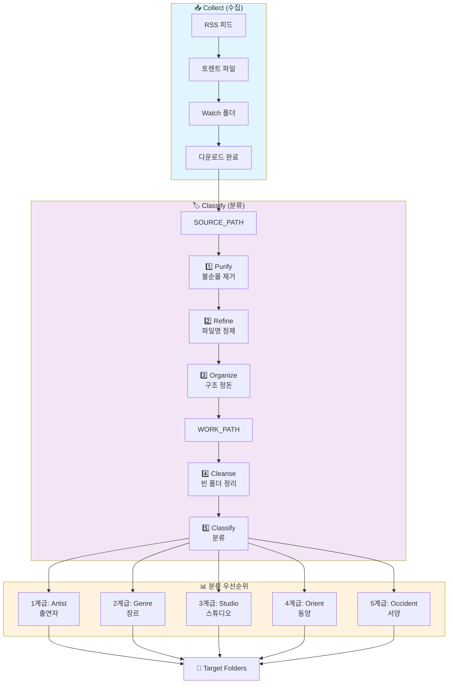

# Meridian-X
*품격 있는 디지털 수집가를 위한 우아한 솔루션*

**Meridian-X**는 귀하의 소중한 프라이빗 미디어 컬렉션을 완벽한 상태로 유지하기 위해 설계된 맞춤형 자동화 스위트입니다. 귀하의 디지털 서고가 항상 정돈되고, 깨끗하며, 즉시 감상 가능한 상태를 유지하도록 돕습니다.

---

## 🧐 철학 (Philosophy)
신사의 서재는 언제나 정갈해야 합니다. **Meridian-X**는 보이지 않는 곳에서 다음과 같이 봉사합니다:
- **수집 (Collect):** Whisparr가 수집할 수 없는 특별한 작품들을 신사의 취향에 맞추어 우아하게 수집합니다.
- **정화 (Sanitize):** 파일명에 붙은 보기 흉한 광고 문구, 홍보용 태그, 그리고 가치 없는 부산물들을 정중하게 제거합니다.
- **큐레이션 (Curate):** 동양과 서양, 그리고 특별한 취향(Niche)에 맞춰 콘텐츠를 자동으로 분류하고 적절한 위치로 안내합니다.

---
## 🔄 워크플로우 (Workflow)



---

## 📁 프로젝트 구조

```
Meridian-X/
├── .gitignore
├── README.md
├── pyproject.toml
├── uv.lock
├── config/
│   ├── settings.json          # 전체 설정 (git 제외)
│   └── settings.json.example  # 설정 템플릿
└── src/meridian_x/
    ├── __init__.py
    ├── cli.py                 # CLI 진입점
    ├── classify.py            # 분류 로직
    └── collect.py             # 수집 로직
```

---

## ⚙️ 설정 (Configuration)

### settings.json 구조

```json
{
  "feed": {
    "base_url": "https://example.com",
    "rss_url": "https://example.com/feeds/"
  },
  "download": {
    "watch_path": "/path/to/torrent/watch",
    "history_file": "logs/downloads.txt",
    "request_timeout": 30,
    "user_agent": "Mozilla/5.0 ..."
  },
  "classify": {
    "source_path": "/path/to/source",
    "work_path": "/path/to/work",
    "target_dirs": ["target1", "target2"],
    "artist_folders": ["ArtistA", "ArtistB"],
    "studio_folders": ["StudioX", "StudioY"],
    "delete_keywords": ["sample", "trailer", "preview"],
    "delete_extensions": [".txt", ".url", ".nfo"],
    "video_extensions": [".mp4", ".mkv", ".avi"]
  },
  "genres": {
    "GenreName": {
      "keywords": ["keyword1"],
      "prefixes": ["PRE-"]
    }
  }
}
```

> **참고:** `config/settings.json`은 git에서 제외됩니다. `settings.json.example`을 복사하여 수정하세요.

---

## 🎩 주요 기능 (Features)

### Collect (수집)
RSS에서 최신 토렌트를 자동으로 수집합니다.
- **RSS 수집:** 공개 RSS 피드 파싱
- **Favorite 필터:** 선호 출연자만 골라서 다운로드
- **다운로드 제한:** 최대 개수 설정으로 과도한 수집 방지
- **히스토리 관리:** 중복 다운로드 방지

### Classify (분류)

#### 1. 불순물 제거 (Purify)
감상의 품위를 해치는 불필요한 요소들을 정중히 배제합니다.
- **확장자 정리:** `.txt`, `.url`, `.lnk`, `.tmp`, `.log`, `.dat`, `.html`, `.nfo`
- **보조 자료 제외:** sample, trailer, preview, promo 등 본편 외 파일
- **소형 파일 배제:** 50MB 이하 영상 파일

#### 2. 파일명 정제 (Refine)
파일명에 남은 불필요한 수식어를 우아하게 제거합니다.
- **정제 대상:** `adsite.net@` 등의 광고성 접두사

#### 3. 구조 정돈 (Organize)
복잡한 하위 폴더 구조를 깔끔하게 평준화합니다.
- SOURCE_PATH 하위 폴더 → WORK_PATH 루트로 이동
- 중복 파일은 자동으로 제거

#### 4. 여백 정리 (Cleanse)
모든 정리 작업 완료 후 빈 공간을 깔끔하게 정돈합니다.

#### 5. 우아한 분류 체계 (Elegant Classification)
WORK_PATH에서 TARGET_PATH로 품격 있게 분류합니다:

**1계급: 출연자 (Artist)**
- settings.json의 `artist_folders`에 정의된 출연자

**2계급: 장르 (Genre)**
- settings.json의 `genres`에 정의된 키워드/접두사 규칙

**3계급: 스튜디오 (Studio)**
- settings.json의 `studio_folders`에 정의된 스튜디오

**4계급: 동양 (Orient)**
- 패턴: 영문 3-5글자 + "-" + 숫자 3-5자리
- 예: ABC-001.mp4, XYZ-123.mp4

**5계급: 서양 (Occident)**
- 위 규칙에 매칭되지 않은 나머지 영상 파일

---

## 🥂 사용법 (Usage)

큐레이션을 시작하시려면, 그저 집사를 호출하십시오:

```bash
# 설정 파일 복사
cp config/settings.json.example config/settings.json
# settings.json 편집...

# ========== Collect (수집) ==========
uv run meridian collect                          # RSS 전체 다운로드 (최대 30개)
uv run meridian collect --dry-run                # 다운로드 미리보기
uv run meridian collect --max-downloads 50       # 최대 50개 다운로드
uv run meridian collect --favorite URL           # Favorite 출연자만 필터링
uv run meridian collect --favorite URL --max-downloads 10  # 조합

# ========== Classify (분류) ==========
uv run meridian classify              # 분류 실행
uv run meridian classify --dry-run    # 미리보기
```

---

## 📋 명령어 옵션

### collect
| 옵션 | 설명 | 기본값 |
|------|------|--------|
| `--dry-run` | 실제 다운로드 없이 미리보기 | - |
| `--max-downloads N` | 최대 다운로드 수 | 30 |
| `--favorite URL` | Favorite URL (출연자 필터링) | - |

### classify
| 옵션 | 설명 |
|------|------|
| `--dry-run` | 실제 변경 없이 미리보기 |

---

*Meridian-X는 조용히 관찰하고, 정리하며, 오직 필요할 때만 보고할 것입니다.*

---
*"질서는 정신의 건전함이자, 신체의 건강이며, 도시의 평화이다."*
