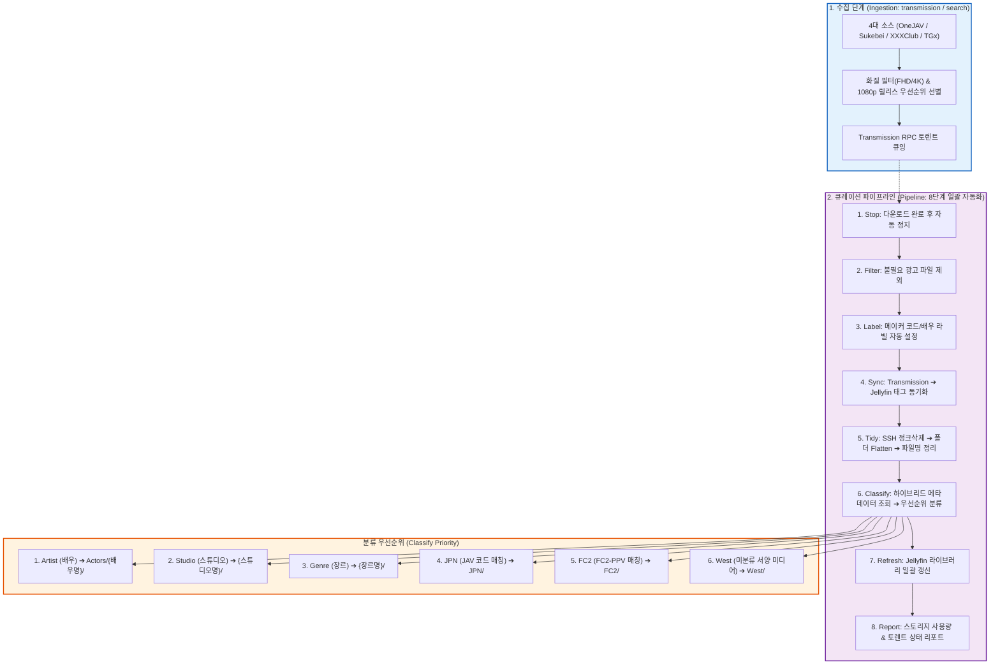

# Meridian-X

[](https://github.com/deuxksy/Meridian-X/actions/workflows/security-scan.yml)

*품격 있는 디지털 수집가를 위한 우아한 솔루션*

**Meridian-X**는 프라이빗 미디어 컬렉션을 자동 수집·정리·분류·동기화하는 Python 자동화 스위트입니다. 4대 미디어 소스(OneJAV, Sukebei, XXXClub, TorrentGalaxy) 기반 고화질(FHD/4K) 수집, 광고 파일 정리, JAV/West 메타데이터 조회, Jellyfin 태그 동기화 및 SSH 원격 분류를 하나의 운영 흐름으로 제공합니다.

---

## 목차

- [철학 (Philosophy)](#-철학-philosophy)
- [워크플로우 (Workflow)](#-워크플로우-workflow)
- [프로젝트 구조](#-프로젝트-구조)
- [설정 (Configuration)](#-설정-configuration)
- [주요 기능 (Features)](#-주요-기능-features)
- [사용법 (Usage)](#-사용법-usage)
- [명령어 옵션](#-명령어-옵션)
- [문서 (Documents)](#-문서-documents)
- [라이선스 (License)](#-라이선스-license)

---

## 🧐 철학 (Philosophy)
신사의 서재는 언제나 정갈해야 합니다. **Meridian-X**는 보이지 않는 곳에서 다음과 같이 봉사합니다:
- **수집 (Collect):** Whisparr가 수집할 수 없는 특별한 작품들을 신사의 취향에 맞추어 우아하게 수집합니다.
- **정화 (Sanitize):** 파일명에 붙은 보기 흉한 광고 문구, 홍보용 태그, 그리고 가치 없는 부산물들을 정중하게 제거합니다.
- **큐레이션 (Curate):** 동양과 서양, 그리고 특별한 취향(Niche)에 맞춰 콘텐츠를 자동으로 분류하고 적절한 위치로 안내합니다.

---
## 🔄 워크플로우 (Workflow)


```mermaid
graph TB
    subgraph Ingest["1. 수집 단계 (Ingestion: transmission / search)"]
        SRC["4대 소스 (OneJAV / Sukebei / XXXClub / TGx)"] --> DEDUP["화질 필터(FHD/4K) & 1080p 릴리스 우선순위 선별"]
        DEDUP --> TX_ADD["Transmission RPC 토렌트 큐잉"]
    end

    subgraph Pipeline["2. 큐레이션 파이프라인 (Pipeline: 8단계 일괄 자동화)"]
        TX_ADD -.-> S1
        S1["1. Stop: 다운로드 완료 후 자동 정지"] --> S2["2. Filter: 불필요 광고 파일 제외"]
        S2 --> S3["3. Label: 메이커 코드/배우 라벨 자동 설정"]
        S3 --> S4["4. Sync: Transmission ➔ Jellyfin 태그 동기화"]
        S4 --> S5["5. Tidy: SSH 정크삭제 ➔ 폴더 Flatten ➔ 파일명 정리"]
        S5 --> S6["6. Classify: 하이브리드 메타데이터 조회 ➔ 우선순위 분류"]
        S6 --> S7["7. Refresh: Jellyfin 라이브러리 일괄 갱신"]
        S7 --> S8["8. Report: 스토리지 사용량 & 토렌트 상태 리포트"]
    end

    subgraph ClassifyPriority["분류 우선순위 (Classify Priority)"]
        S6 --> P1["1. Artist (배우) ➔ Actors/{배우명}/"]
        S6 --> P2["2. Studio (스튜디오) ➔ {스튜디오명}/"]
        S6 --> P3["3. Genre (장르) ➔ {장르명}/"]
        S6 --> P4["4. JPN (JAV 코드 매칭) ➔ JPN/"]
        S6 --> P5["5. FC2 (FC2-PPV 매칭) ➔ FC2/"]
        S6 --> P6["6. West (미분류 서양 미디어) ➔ West/"]
    end

    style Ingest fill:#e3f2fd,stroke:#1565c0,stroke-width:2px
    style Pipeline fill:#f3e5f5,stroke:#6a1b9a,stroke-width:2px
    style ClassifyPriority fill:#fff3e0,stroke:#e65100,stroke-width:2px
```

---

## 📁 프로젝트 구조

```
Meridian-X/
├── README.md
├── ROADMAP.md
├── AGENTS.md
├── pyproject.toml
├── uv.lock
├── config/
│   ├── settings.json          # 전체 설정 (git 제외)
│   ├── settings.json.sops     # sops+age 암호화 추적본
│   └── settings.json.example  # 설정 템플릿
├── tests/                     # pytest 회귀 테스트 스위트 (19개 모듈)
└── src/meridian_x/
    ├── cli.py                 # CLI 진입점
    ├── collect.py             # Multi-source 수집 오케스트레이터
    ├── sources/               # 수집 source 모듈 (onejav, sukebei, xxxclub, torrentgalaxy)
    ├── transmission.py        # Transmission RPC 클라이언트
    ├── jellyfin.py            # Jellyfin REST API 클라이언트
    ├── tidy.py                # 원격 파일 정리 (SSH)
    ├── classify.py            # 원격 파일 분류 (SSH)
    ├── report.py              # disk/토렌트 상태 리포트
    ├── db.py                  # SQLite 저장소 (download_history, jav_metadata, west_metadata)
    ├── fanza.py               # FANZA API 클라이언트
    ├── jav_lookup.py          # JAV 배우 2차 분류 조회
    ├── jav_metadata.py        # JAV 메타데이터 통합 Resolver (FANZA -> JavBus -> OneJAV)
    ├── west_metadata.py       # StashDB GraphQL API West 메타데이터 Resolver
    ├── remote.py              # SSH 원격 명령 및 프록시 curl 실행 전용 모듈
    └── core.py                # 공통 함수 (설정/화질필터/중복선별)
```

---

## ⚙️ 설정 (Configuration)

### settings.json 구조

최상위 키 구조는 다음과 같습니다 (전체 필드는 `config/settings.json.example` 참조):

| 키 | 용도 |
| :--- | :--- |
| `sources` | 수집 source 설정 (onejav, sukebei, xxxclub, torrentgalaxy — RSS URL, 미러, SSH 우회 등) |
| `transmission` | Transmission RPC 연결 (`rpc_url`, 인증, `stop_after_download`) |
| `jellyfin` | Jellyfin REST API (`url`, `api_key`) |
| `remote` | 원격 서버 SSH (`host`, `user`, `ssh_key`, `path`) — tidy/classify 대상 |
| `collection` | 수집 히스토리/요청 설정 (`history_file`, `request_timeout`, `user_agent`) |
| `classify` | 분류 규칙 (`artists`/`studios` WEST·JPN dict, `source_path`, `work_path` 등) |
| `genres` | 장르별 키워드/접두사 규칙 |

> **참고:** `config/settings.json`은 git에서 제외됩니다. `settings.json.example`을 복사하여 수정하세요.

---

## 🎩 주요 기능 (Features)

### 1. Collect & Search (수집 및 키워드 검색)
- **4대 멀티 소스 연동:** OneJAV(RSS/SSH 우회), Sukebei(RSS/키워드 검색), XXXClub(RSS/키워드 검색), TorrentGalaxy(RSS/초고속 JSON API 검색).
- **화질 및 릴리스 우선순위 선별 (`deduplicate_releases`):** 8K/VR 및 720p/SD/DVD를 배제하고 **1080p(FHD) 최우선 + 안정적인 릴 그룹(`WRB`/`XC` > `TRB` > `P2P`)**을 자동 선별하여 동일 에피소드 중복 다운로드 방지.
- **Selective Download:** 광고/홍보 파일 자동 unwanted 제외 필터링.
- **자동 라벨링:** 토렌트 제목에서 품번/스튜디오/배우 추출 및 Transmission 라벨 설정.

### 2. Pipeline (8단계 원클릭 자동 큐레이션)
수집된 미디어를 정제하고 라이브러리에 안전하게 정돈하기 위한 8단계 일괄 실행 파이프라인:
1. **Stop:** 다운로드 완료 토렌트 자동 정지 (`stop_after_download_existing`)
2. **Filter:** 광고/정크 파일 제외 필터링 (`filter_existing`)
3. **Label:** 메이커 코드/배우 라벨 자동 설정 (`label_existing`)
4. **Sync:** Transmission 라벨 ➔ Jellyfin 태그 동기화 (`sync_tags`)
5. **Tidy:** SSH 원격 정크 삭제 ➔ 단일 영상 폴더 Flatten ➔ 파일명 접두사(`4K688` 등) 정리
6. **Classify:** FANZA/JavBus/StashDB 메타데이터 조회 ➔ 1. 배우 / 2. 스튜디오 / 3. 장르 / 4. JPN / 5. FC2 / 6. West 우선순위 분류
7. **Refresh:** Jellyfin 라이브러리 일괄 갱신
8. **Report:** 시스템 디스크 사용량 및 토렌트 상태 리포트

### 3. Tidy (원격 파일 정화)
- **정크 삭제:** 광고 파일, URL 바로가기, 섬네일 부산물 등 삭제.
- **폴더 Flatten:** 단일 비디오만 들어 있는 불필요한 하위 폴더를 상위로 평준화.
- **파일명 정리:** `hhd800.com@`, `4K688` 등 보기 흉한 상업용 광고 접두사 정중히 제거.

### 4. Classify (하이브리드 메타데이터 분류)
SSH 원격 파일 이동 + 외부 API 메타데이터 조회를 결합한 스마트 분류:
1. **배우 (Artist)** — `classify.artists` 딕셔너리 매칭 및 FANZA/JavBus/StashDB 조회 결과 ➔ `Actors/{배우명}/` 이동
2. **스튜디오 (Studio)** — `classify.studios` 딕셔너리 매칭 및 API 메타데이터 ➔ `{스튜디오명}/` 이동
3. **장르 (Genre)** — `genres` 키워드/접두사 규칙에 따른 장르 폴더 이동
4. **JPN** — JAV 코드 패턴 `^[A-Z0-9]{3,7}-\d{2,5}[-\.\s]` (예: SONE-446, 200GANA-3399) ➔ `JPN/` 이동
5. **FC2** — `FC2-PPV-*` 패턴 ➔ `FC2/` 이동
6. **West** — 미분류 서양 미디어 ➔ `West/` 이동

---

## 🥂 사용법 (Usage)

큐레이션을 시작하시려면, 그저 집사를 호출하십시오:

```bash
# ========== Setup (초기 설정) ==========
uv sync                                    # 의존성 설치
cp config/settings.json.example config/settings.json
# 또는 sops로 암호화 설정 복원:
sops --decrypt --input-type binary --output-type binary config/settings.json.sops > config/settings.json

# ========== Ingest: Collect (정기 RSS 수집) ==========
uv run meridian transmission --dry-run            # 수집 항목 미리보기 (권장)
uv run meridian transmission                      # 전체 4대 소스 RSS 일괄 수집 (기본 최대 30개)
uv run meridian transmission --source onejav      # OneJAV만
uv run meridian transmission --source sukebei     # Sukebei만
uv run meridian transmission --source xxxclub     # XXXClub만
uv run meridian transmission --source tgx         # TorrentGalaxy만
uv run meridian transmission --max-downloads 50   # 최대 수집 개수 지정

# ========== Ingest: Search (키워드 검색 및 선별 수집) ==========
uv run meridian search "Dakota Doll"               # 대화형 선택 다운로드 (1080p 및 WRB/XC 릴 우선 정렬)
uv run meridian search "MINAMO" --source sukebei   # Sukebei JAV 검색
uv run meridian search "Angela White" --source tgx # TorrentGalaxy 서양 고화질 검색
uv run meridian search "Dakota Doll" --auto --delay 3 # 자동 전체 수집 (요청 간격 3초 delay)

# ========== Pipeline (8단계 일괄 자동 큐레이션) ==========
uv run meridian pipeline --dry-run      # 전체 파이프라인 변경 사항 미리보기 (강력 권장)
uv run meridian pipeline                # stop→filter→label→sync→tidy→classify→갱신→report 실행
uv run meridian pipeline --no-refresh   # Jellyfin 라이브러리 갱신 스킵
uv run meridian pipeline --lookup-jav   # JPN/ 내 파일 웹 DB 조회 기반 배우 폴더 2차 재분류

# ========== 개별 운영 커맨드 ==========
uv run meridian filter                  # 기존 토렌트 광고 파일 일괄 제외
uv run meridian label                   # 메이커 코드/스튜디오/배우 labels 자동 설정
uv run meridian sync                    # Transmission labels → Jellyfin Tags 동기화
uv run meridian tidy                    # 원격 정리 (정크삭제→Flatten→파일명정리)
uv run meridian classify --dry-run      # 원격 분류 미리보기
uv run meridian classify                # 원격 분류 실행 (API 메타데이터 lookup 포함)
uv run meridian report                  # disk 사용량 + Transmission 토렌트 상태 리포트
```

---

## 📋 명령어 옵션

### transmission
| 옵션 | 설명 | 기본값 |
| :--- | :--- | :--- |
| `--dry-run` | 실제 전송 없이 수집 대상 항목만 출력 | - |
| `--source NAME` | 수집 소스 지정 (`onejav`, `sukebei`, `xxxclub`, `torrentgalaxy`/`tgx`) | 전체 |
| `--max-downloads N` | 최대 다운로드 수 (전체 소스 합산) | 30 |

### search
| 옵션 | 설명 | 기본값 |
| :--- | :--- | :--- |
| `--category CAT` | 검색 대상 카테고리 (Sukebei: `2_2`, XXXClub: `1080p`, TGx: `42`) | 소스별 기본값 |
| `--source NAME` | 검색 대상 소스 (`xxxclub`, `sukebei`, `torrentgalaxy`/`tgx`) | `xxxclub` |
| `--auto` | 자동 전체 다운로드 모드 (비대화형) | off (대화형 선택) |
| `--delay SEC` | 자동 모드 요청 간격 delay (초) | 5.0 |

### pipeline
| 옵션 | 설명 | 기본값 |
| :--- | :--- | :--- |
| `--dry-run` | 실제 파일 이동이나 API 변경 없이 결과만 출력 | - |
| `--no-refresh` | 파이프라인 완료 후 Jellyfin 라이브러리 갱신 스킵 | - |
| `--lookup-jav` | JPN 폴더 내 파일 웹 DB 조회 기반 배우 폴더 2차 분류 활성화 | off |

### tidy / classify
| 옵션 | 설명 | 기본값 |
| :--- | :--- | :--- |
| `--dry-run` | 실제 파일 삭제/이동 없이 결과만 출력 | - |
| `--no-lookup` | (classify 전용) 외부 API 메타데이터 조회 스킵 | - |
| `--lookup-jav` | (classify 전용) JPN 폴더 내 파일 배우 폴더 2차 분류 | - |

### report
옵션 없음. 스토리지 disk 사용량 및 Transmission 토렌트 상태 요약 출력 (읽기 전용).

---

## 📚 문서 (Documents)

| 분류 (Diátaxis) | 문서 | 설명 |
| :--- | :--- | :--- |
| Tutorials | [Tutorials Hub](./docs/tutorials/README.md) | 입문 및 첫 실행 가이드 |
| How-To | [How-To Hub](./docs/how-to/README.md) | 특정 운영 작업 수행 절차 |
| Reference | [Reference Hub](./docs/reference/README.md) | 설정, CLI, 문서 구조 참조 |
| Reference | [Documentation Hub](./docs/README.md) | `docs/` 디렉터리 구조 및 문서 분류 안내 |
| Explanation | [Roadmap](./ROADMAP.md) | 버전별 현황과 향후 계획 |
| Explanation | [Explanation Hub](./docs/explanation/README.md) | 아키텍처, 설계 결정, 배경 설명 |
| Explanation | [Security Scan 설계](./docs/explanation/security-scan-design.md) | 보안 스캔 도입 배경과 설계 결정 |
| How-To | [Security Scan 구현](./docs/how-to/security-scan-implementation.md) | 보안 스캔 구현 단계 계획 |

---

## 📄 라이선스 (License)

MIT License — [LICENSE](./LICENSE) 참조.

---

*Meridian-X는 조용히 관찰하고, 정리하며, 오직 필요할 때만 보고할 것입니다.*

---
*"질서는 정신의 건전함이자, 신체의 건강이며, 도시의 평화이다."*
