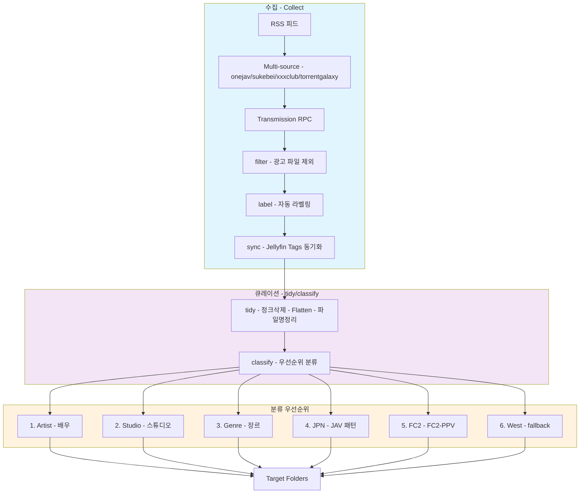

# Meridian-X

[](https://github.com/deuxksy/Meridian-X/actions/workflows/security-scan.yml)

*품격 있는 디지털 수집가를 위한 우아한 솔루션*

**Meridian-X**는 프라이빗 미디어 컬렉션을 자동 수집·정리·분류·동기화하는 Python 자동화 스위트입니다. 4대 미디어 소스(OneJAV, Sukebei, XXXClub, TorrentGalaxy) 기반 고화질(FHD/4K) 수집, 광고 파일 정리, JAV/West 메타데이터 조회, Jellyfin 태그 동기화 및 SSH 원격 분류를 하나의 운영 흐름으로 제공합니다.

---

## 목차

- [철학 (Philosophy)](#-철학-philosophy)
- [워크플로우 (Workflow)](#-워크플로우-workflow)
- [프로젝트 구조](#-프로젝트-구조)
- [설정 (Configuration)](#-설정-configuration)
- [주요 기능 (Features)](#-주요-기능-features)
- [사용법 (Usage)](#-사용법-usage)
- [명령어 옵션](#-명령어-옵션)
- [문서 (Documents)](#-문서-documents)
- [라이선스 (License)](#-라이선스-license)

---

## 🧐 철학 (Philosophy)
신사의 서재는 언제나 정갈해야 합니다. **Meridian-X**는 보이지 않는 곳에서 다음과 같이 봉사합니다:
- **수집 (Collect):** Whisparr가 수집할 수 없는 특별한 작품들을 신사의 취향에 맞추어 우아하게 수집합니다.
- **정화 (Sanitize):** 파일명에 붙은 보기 흉한 광고 문구, 홍보용 태그, 그리고 가치 없는 부산물들을 정중하게 제거합니다.
- **큐레이션 (Curate):** 동양과 서양, 그리고 특별한 취향(Niche)에 맞춰 콘텐츠를 자동으로 분류하고 적절한 위치로 안내합니다.

---
## 🔄 워크플로우 (Workflow)


```mermaid
graph TB
    subgraph Collect[수집 - Collect]
        RSS[RSS 피드] --> SRC[Multi-source - onejav/sukebei/xxxclub/torrentgalaxy]
        SRC --> TX[Transmission RPC]
        TX --> FIL[filter - 광고 파일 제외]
        FIL --> LAB[label - 자동 라벨링]
        LAB --> SYN[sync - Jellyfin Tags 동기화]
    end

    subgraph Curate[큐레이션 - tidy/classify]
        TIDY[tidy - 정크삭제 - Flatten - 파일명정리] --> CLS[classify - 우선순위 분류]
    end

    subgraph Priority[분류 우선순위]
        CLS --> A1[1. Artist - 배우]
        CLS --> A2[2. Studio - 스튜디오]
        CLS --> A3[3. Genre - 장르]
        CLS --> A4[4. JPN - JAV 패턴]
        CLS --> A5[5. FC2 - FC2-PPV]
        CLS --> A6[6. West - fallback]
    end

    SYN --> TIDY
    A1 --> TARGET[Target Folders]
    A2 --> TARGET
    A3 --> TARGET
    A4 --> TARGET
    A5 --> TARGET
    A6 --> TARGET

    style Collect fill:#e1f5fe
    style Curate fill:#f3e5f5
    style Priority fill:#fff3e0
```

---

## 📁 프로젝트 구조

```
Meridian-X/
├── README.md
├── ROADMAP.md
├── AGENTS.md
├── pyproject.toml
├── uv.lock
├── config/
│   ├── settings.json          # 전체 설정 (git 제외)
│   ├── settings.json.sops     # sops+age 암호화 추적본
│   └── settings.json.example  # 설정 템플릿
├── tests/                     # pytest 회귀 테스트 스위트 (19개 모듈)
└── src/meridian_x/
    ├── cli.py                 # CLI 진입점
    ├── collect.py             # Multi-source 수집 오케스트레이터
    ├── sources/               # 수집 source 모듈 (onejav, sukebei, xxxclub, torrentgalaxy)
    ├── transmission.py        # Transmission RPC 클라이언트
    ├── jellyfin.py            # Jellyfin REST API 클라이언트
    ├── tidy.py                # 원격 파일 정리 (SSH)
    ├── classify.py            # 원격 파일 분류 (SSH)
    ├── report.py              # disk/토렌트 상태 리포트
    ├── db.py                  # SQLite 저장소 (download_history, jav_metadata, west_metadata)
    ├── fanza.py               # FANZA API 클라이언트
    ├── jav_lookup.py          # JAV 배우 2차 분류 조회
    ├── jav_metadata.py        # JAV 메타데이터 통합 Resolver (FANZA -> JavBus -> OneJAV)
    ├── west_metadata.py       # StashDB GraphQL API West 메타데이터 Resolver
    ├── remote.py              # SSH 원격 명령 및 프록시 curl 실행 전용 모듈
    └── core.py                # 공통 함수 (설정/화질필터/중복선별)
```

---

## ⚙️ 설정 (Configuration)

### settings.json 구조

최상위 키 구조는 다음과 같습니다 (전체 필드는 `config/settings.json.example` 참조):

| 키 | 용도 |
| :--- | :--- |
| `sources` | 수집 source 설정 (onejav, sukebei, xxxclub, torrentgalaxy — RSS URL, 미러, SSH 우회 등) |
| `transmission` | Transmission RPC 연결 (`rpc_url`, 인증, `stop_after_download`) |
| `jellyfin` | Jellyfin REST API (`url`, `api_key`) |
| `remote` | 원격 서버 SSH (`host`, `user`, `ssh_key`, `path`) — tidy/classify 대상 |
| `collection` | 수집 히스토리/요청 설정 (`history_file`, `request_timeout`, `user_agent`) |
| `classify` | 분류 규칙 (`artists`/`studios` WEST·JPN dict, `source_path`, `work_path` 등) |
| `genres` | 장르별 키워드/접두사 규칙 |

> **참고:** `config/settings.json`은 git에서 제외됩니다. `settings.json.example`을 복사하여 수정하세요.

---

## 🎩 주요 기능 (Features)

### Collect (수집)
Multi-source RSS 수집 → Transmission RPC 전송.
- **Multi-source:** onejav(RSS → .torrent), sukebei(RSS/검색 → magnet), xxxclub(RSS/검색 → magnet), torrentgalaxy(RSS/JSON API 검색 → magnet)
- **엄격한 화질 선별:** 저화질(720p/SD) 및 8K/VR을 배제하고 **FHD(1080p) 및 4K(2160p)** 고화질만 선별 다운로드
- **Selective download:** 광고 파일 자동 제외 (확장자/키워드/최소 크기 필터)
- **자동 라벨링:** torrent name에서 메이커 코드/스튜디오/배우 추출
- **Source 선택:** `--source`로 특정 source만 실행
- **히스토리 관리:** `{source}:{id}` 형태로 중복 수집 방지

### Search (검색 및 수집)
멀티 소스(XXXClub, Sukebei, TorrentGalaxy) 키워드 검색 → 대화형/자동 선택 수집.
- **대화형 모드 (기본):** 검색 결과를 번호로 나열하여 사용자가 원하는 토렌트 선택 다운로드
- **자동 모드 (`--auto`):** 검색 결과 전체 순차 수집 + 요청 간격 delay (`--delay 5.0`)로 IP 차단 방지
- **중복 검사:** DB 수집 히스토리를 확인하여 이미 수집된 항목 자동 스킵

### Tidy (원격 정리)
SSH 기반 원격 파일 정리 (heritage 서버). tidy → classify 워크플로우의 첫 단계.
- **정크 삭제:** Jellyfin API로 키워드/확장자 기반 정크 파일 삭제
- **Flatten:** 비디오 1개 폴더를 상위로 평준화
- **파일명 정리:** 광고 접두사 제거 (`hhd800.com@` 등)
- **라이브러리 갱신:** Jellyfin library refresh

### Classify (원격 분류)
tidy(flatten) 이후, flatten된 파일을 우선순위별로 분류. SSH 하이브리드 방식 (Python 매칭 로직 + SSH `mv`). JPN(FANZA/JavBus/OneJAV) 및 West(StashDB GraphQL API) 메타데이터를 하이브리드로 자동 수집하여 배우(`Actors/{배우명}/`) 또는 스튜디오 폴더로 1차/2차 분류를 수행합니다.

**분류 우선순위:**
1. **배우 (Artist)** — `classify.artists` (파일명 포함 매칭) 및 JPN/West API 메타데이터
2. **스튜디오 (Studio)** — `classify.studios` (예: Vixen, Nubile) 및 JPN/West API 메타데이터
3. **장르 (Genre)** — `genres` 키워드/접두사 규칙
4. **JPN** — JAV 패턴 `^[A-Z0-9]{3,7}-\d{2,5}[-\.\s]` (예: SONE-446, 200GANA-3399)
5. **FC2** — `FC2-PPV-*` 패턴
6. **West** — 매칭되지 않은 나머지 영상 파일 (StashDB 수집 후 fallback)

> tidy(정리) → classify(분류) 순서로 실행. 중복 파일은 원본 삭제.

---

## 🥂 사용법 (Usage)

큐레이션을 시작하시려면, 그저 집사를 호출하십시오:

```bash
# ========== Setup (초기 설정) ==========
uv sync                                    # 의존성 설치
cp config/settings.json.example config/settings.json
# settings.json 편집...

# ========== Collect (수집) ==========
uv run meridian transmission --dry-run            # 항상 먼저 미리보기 (권장)
uv run meridian transmission                      # 전체 source 수집 (최대 30개)
uv run meridian transmission --source onejav      # onejav만
uv run meridian transmission --source sukebei     # sukebei만
uv run meridian transmission --source xxxclub     # xxxclub만
uv run meridian transmission --source tgx         # torrentgalaxy만
uv run meridian transmission --max-downloads 50   # 최대 50개 (전체 source 합산)

# ========== Search (키워드 검색 및 수집) ==========
uv run meridian search "Dakota Doll"               # 대화형 선택 다운로드 (기본: 1080p 카테고리)
uv run meridian search "MINAMO" --source sukebei   # Sukebei JAV 검색
uv run meridian search "Angela White" --source tgx # TorrentGalaxy 서양 고화질 검색
uv run meridian search "Dakota Doll" --auto --delay 5 # 자동 전체 수집 (요청 간격 5초 delay)

# ========== Filter (기존 토렌트 필터링) ==========
uv run meridian filter                  # 기존 토렌트 광고 파일 일괄 제외

# ========== Label (기존 토렌트 라벨링) ==========
uv run meridian label                   # 메이커 코드/스튜디오/배우 labels 자동 설정

# ========== Sync (Transmission → Jellyfin) ==========
uv run meridian sync                    # Transmission labels & JPN/West 메타데이터(Studios/Genres/People/Tags) → Jellyfin 동기화

# ========== Tidy (원격 정리) ==========
uv run meridian tidy                    # 정크삭제→Flatten→파일명정리→갱신

# ========== Classify (원격 분류, tidy 후 실행) ==========
uv run meridian classify --dry-run      # 미리보기 (권장)
uv run meridian classify                # SSH 원격 분류 (API 메타데이터 자동 lookup 포함)
uv run meridian classify --no-lookup    # 외부 API 조회 없이 단순 수동 규칙 분류만 수행
uv run meridian classify --lookup-jav   # JPN/ 내 파일 웹 DB 조회 기반 배우 폴더 2차 재분류

# ========== Pipeline (한 번에 실행) ==========
uv run meridian pipeline --dry-run      # 미리보기 (권장)
uv run meridian pipeline                # stop→filter→label→sync→tidy→classify→갱신→report

# ========== Report (상태 조회) ==========
uv run meridian report                  # disk 사용량 + Transmission 토렌트 상태
```

---

## 📋 명령어 옵션

### transmission
| 옵션 | 설명 | 기본값 |
| :--- | :--- | :--- |
| `--dry-run` | 실제 전송 없이 수집 항목만 출력 | - |
| `--source NAME` | 수집 source 지정 (onejav, sukebei, xxxclub, torrentgalaxy/tgx) | 전체 |
| `--max-downloads N` | 최대 다운로드 수 (전체 source 합산) | 30 |

### search
| 옵션 | 설명 | 기본값 |
| :--- | :--- | :--- |
| `--category CAT` | 검색 대상 카테고리 | 1080p |
| `--source NAME` | 검색 대상 source (xxxclub, sukebei, torrentgalaxy/tgx) | xxxclub |
| `--auto` | 자동 전체 다운로드 모드 (비대화형) | off (대화형) |
| `--delay SEC` | 자동 모드 요청 간격 delay (초) | 5.0 |

### filter / label
| 옵션 | 설명 | 비고 |
| :--- | :--- | :--- |
| `--dry-run` | 실제 변경 없이 요약만 출력 | 영향받는 항목은 나열하지 않음 |

### tidy / classify
| 옵션 | 설명 | 기본값 |
| :--- | :--- | :--- |
| `--dry-run` | 실제 이동/변경 없이 결과만 출력 | - |
| `--no-lookup` | (classify 전용) 외부 API 메타데이터 조회 스킵 | - |
| `--lookup-jav` | (classify 전용) JPN 폴더 내 파일 배우 폴더 2차 분류 | - |

### sync
옵션 없음. 실행 즉시 Transmission labels → Jellyfin Tags 동기화 (`--dry-run` 미지원).

### pipeline
| 옵션 | 설명 | 기본값 |
| :--- | :--- | :--- |
| `--dry-run` | 실제 변경 없이 결과만 출력 | - |
| `--no-refresh` | Jellyfin 라이브러리 갱신 스킵 | - |

### report
옵션 없음. disk 사용량 + Transmission 토렌트 상태 출력 (읽기 전용).

---

## 📚 문서 (Documents)

| 분류 (Diátaxis) | 문서 | 설명 |
| :--- | :--- | :--- |
| Tutorials | [Tutorials Hub](./docs/tutorials/README.md) | 입문 및 첫 실행 가이드 |
| How-To | [How-To Hub](./docs/how-to/README.md) | 특정 운영 작업 수행 절차 |
| Reference | [Reference Hub](./docs/reference/README.md) | 설정, CLI, 문서 구조 참조 |
| Reference | [Documentation Hub](./docs/README.md) | `docs/` 디렉터리 구조 및 문서 분류 안내 |
| Explanation | [Roadmap](./ROADMAP.md) | 버전별 현황과 향후 계획 |
| Explanation | [Explanation Hub](./docs/explanation/README.md) | 아키텍처, 설계 결정, 배경 설명 |
| Explanation | [Security Scan 설계](./docs/explanation/security-scan-design.md) | 보안 스캔 도입 배경과 설계 결정 |
| How-To | [Security Scan 구현](./docs/how-to/security-scan-implementation.md) | 보안 스캔 구현 단계 계획 |

---

## 📄 라이선스 (License)

MIT License — [LICENSE](./LICENSE) 참조.

---

*Meridian-X는 조용히 관찰하고, 정리하며, 오직 필요할 때만 보고할 것입니다.*

---
*"질서는 정신의 건전함이자, 신체의 건강이며, 도시의 평화이다."*
