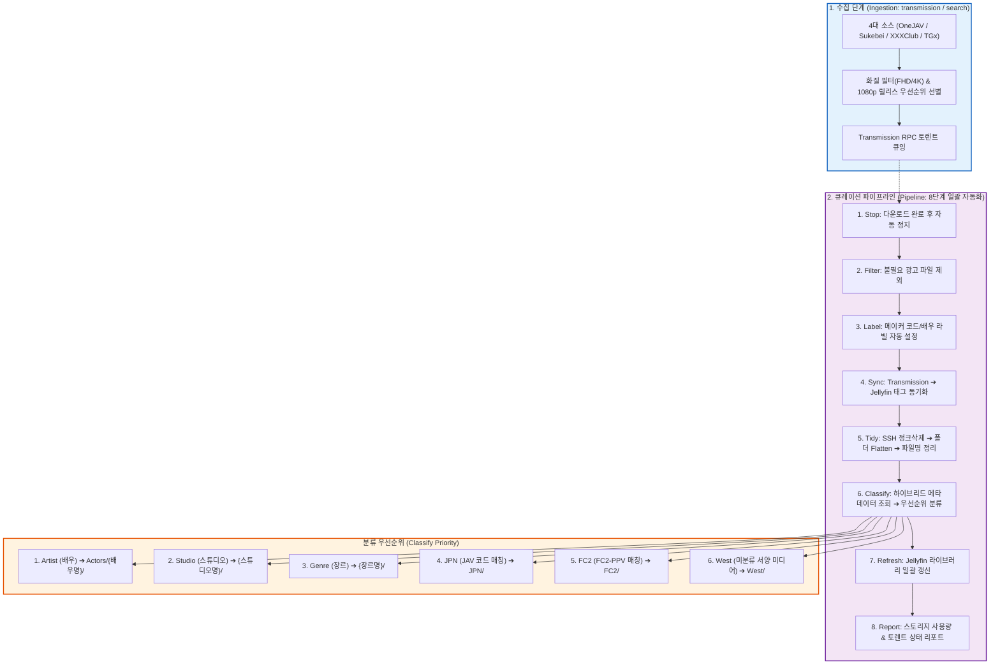

# Meridian-X

[](https://github.com/deuxksy/Meridian-X/actions/workflows/security-scan.yml)

*품격 있는 디지털 수집가를 위한 우아한 솔루션*

**Meridian-X**는 프라이빗 미디어 컬렉션을 자동 수집·정리·분류·동기화하는 Python 자동화 스위트입니다. 4대 미디어 소스(OneJAV, Sukebei, XXXClub, TorrentGalaxy) 기반 고화질(FHD/4K) 수집, 광고 파일 정리, JAV/West 메타데이터 조회, Jellyfin 태그 동기화 및 SSH 원격 분류를 하나의 운영 흐름으로 제공합니다.

---

## 🧐 철학 (Philosophy)

신사의 서재는 언제나 정갈해야 합니다. **Meridian-X**는 보이지 않는 곳에서 다음과 같이 봉사합니다:
- **수집 (Collect):** Whisparr가 수집할 수 없는 특별한 작품들을 신사의 취향에 맞추어 우아하게 수집합니다.
- **정화 (Sanitize):** 파일명에 붙은 보기 흉한 광고 문구, 홍보용 태그, 그리고 가치 없는 부산물들을 정중하게 제거합니다.
- **큐레이션 (Curate):** 동양과 서양, 그리고 특별한 취향(Niche)에 맞춰 콘텐츠를 자동으로 분류하고 적절한 위치로 안내합니다.

---

## 🔄 워크플로우 (Workflow)


```mermaid
graph TB
    subgraph Ingest["1. 수집 단계 (Ingestion: transmission / search)"]
        SRC["4대 소스 (OneJAV / Sukebei / XXXClub / TGx)"] --> DEDUP["화질 필터(FHD/4K) & 1080p 릴리스 우선순위 선별"]
        DEDUP --> TX_ADD["Transmission RPC 토렌트 큐잉"]
    end

    subgraph Pipeline["2. 큐레이션 파이프라인 (Pipeline: 8단계 일괄 자동화)"]
        TX_ADD -.-> S1
        S1["1. Stop: 다운로드 완료 후 자동 정지"] --> S2["2. Filter: 불필요 광고 파일 제외"]
        S2 --> S3["3. Label: 메이커 코드/배우 라벨 자동 설정"]
        S3 --> S4["4. Sync: Transmission ➔ Jellyfin 태그 동기화"]
        S4 --> S5["5. Tidy: SSH 정크삭제 ➔ 폴더 Flatten ➔ 파일명 정리"]
        S5 --> S6["6. Classify: 하이브리드 메타데이터 조회 ➔ 우선순위 분류"]
        S6 --> S7["7. Refresh: Jellyfin 라이브러리 일괄 갱신"]
        S7 --> S8["8. Report: 스토리지 사용량 & 토렌트 상태 리포트"]
    end

    subgraph ClassifyPriority["분류 우선순위 (Classify Priority)"]
        S6 --> P1["1. Artist (배우) ➔ Actors/{배우명}/"]
        S6 --> P2["2. Studio (스튜디오) ➔ {스튜디오명}/"]
        S6 --> P3["3. Genre (장르) ➔ {장르명}/"]
        S6 --> P4["4. JPN (JAV 코드 매칭) ➔ JPN/"]
        S6 --> P5["5. FC2 (FC2-PPV 매칭) ➔ FC2/"]
        S6 --> P6["6. West (미분류 서양 미디어) ➔ West/"]
    end

    style Ingest fill:#e3f2fd,stroke:#1565c0,stroke-width:2px
    style Pipeline fill:#f3e5f5,stroke:#6a1b9a,stroke-width:2px
    style ClassifyPriority fill:#fff3e0,stroke:#e65100,stroke-width:2px
```

---

## 📁 프로젝트 구조

```text
Meridian-X/
├── README.md
├── ROADMAP.md
├── AGENTS.md
├── pyproject.toml
├── uv.lock
├── config/
│   ├── settings.json          # 전체 설정 (git 제외)
│   ├── settings.json.sops     # sops+age 암호화 추적본
│   └── settings.json.example  # 설정 템플릿
├── docs/                      # OKF Diátaxis 문서 및 아카이브
│   ├── okf/                   # 공식 지식 프레임워크 (Tutorials, How-To, Reference, Explanation)
│   ├── archive/               # 비관리형 과거 기획 및 외부 참조 자료
│   └── superpowers/           # AI 에이전트 설계/계획서
├── tests/                     # pytest 회귀 테스트 스위트 (19개 모듈)
└── src/meridian_x/
    ├── cli.py                 # CLI 진입점
    ├── collect.py             # Multi-source 수집 오케스트레이터
    ├── sources/               # 수집 소스 (onejav, sukebei, xxxclub, torrentgalaxy)
    ├── transmission.py        # Transmission RPC 클라이언트
    ├── jellyfin.py            # Jellyfin REST API 클라이언트
    ├── tidy.py                # 원격 파일 정리 (SSH)
    ├── classify.py            # 원격 파일 분류 (SSH)
    ├── report.py              # disk/토렌트 상태 리포트
    ├── db.py                  # SQLite 저장소 (download_history, jav_metadata, west_metadata)
    ├── fanza.py               # FANZA API 클라이언트
    ├── jav_lookup.py          # JAV 배우 2차 분류 조회
    ├── jav_metadata.py        # JAV 메타데이터 통합 Resolver (FANZA -> JavBus -> OneJAV)
    ├── west_metadata.py       # StashDB GraphQL API West 메타데이터 Resolver
    ├── remote.py              # SSH 원격 명령 및 프록시 curl 실행 전용 모듈
    └── core.py                # 공통 함수 (설정/화질필터/중복선별)
```

---

## 🚀 빠른 시작 (Quick Start)

```bash
# 1. 의존성 설치 및 설정 복원
uv sync
cp config/settings.json.example config/settings.json
# 또는 sops로 복원: sops --decrypt --input-type binary --output-type binary config/settings.json.sops > config/settings.json

# 2. 미디어 수집 (정기 RSS 수집 및 키워드 검색)
uv run meridian transmission                      # 4대 소스 정기 수집
uv run meridian search "Dakota Doll"               # 대화형 키워드 검색 및 선별 수집

# 3. 8단계 큐레이션 파이프라인 일괄 실행
uv run meridian pipeline --dry-run                # 변경 사항 미리보기 (권장)
uv run meridian pipeline                          # stop→filter→label→sync→tidy→classify→갱신→report
```

---

## 📚 공식 문서 (OKF Documents)

모든 상세 가이드와 기술 명세는 [Diátaxis](https://diataxis.fr/) 프레임워크 기반 **[OKF Documentation Hub](./docs/okf/README.md)**에 체계적으로 수록되어 있습니다:

| 분류 (Diátaxis) | 문서 | 설명 |
| :--- | :--- | :--- |
| **Framework** | [OKF Hub](./docs/okf/README.md) | 사람 중심 공식 지식 프레임워크 허브 |
| **How-To** | [CLI 운영 가이드](./docs/okf/how-to/cli-usage.md) | 수집, 검색, 8단계 파이프라인 등 전체 명령어 상세 가이드 |
| **How-To** | [Security Scan 구축](./docs/okf/how-to/security-scan-implementation.md) | GitHub Actions 보안 스캔 파이프라인 구축 절차 |
| **Reference** | [설정 명세 (Configuration)](./docs/okf/reference/configuration.md) | `settings.json` 전체 키 스키마 및 SOPS 암호화 명세 |
| **Reference** | [CLI 옵션 레퍼런스](./docs/okf/reference/cli-options.md) | 모든 서브커맨드별 파라미터 및 옵션 상세 표 |
| **Explanation** | [아키텍처 & 워크플로우](./docs/okf/explanation/architecture-and-workflow.md) | 2단계 아키텍처, 8단계 파이프라인 및 릴리스 선별 원리 |
| **Explanation** | [Security Scan 설계](./docs/okf/explanation/security-scan-design.md) | 보안 스캔 도입 배경 및 설계 결정 |
| **Explanation** | [로드맵 (Roadmap)](./ROADMAP.md) | 버전별 완성 현황 및 향후 계획 |
| **Archive** | [Docs Archive](./docs/archive/README.md) | 비관리형 과거 기획 및 외부 참조 자료 |

---

## 📄 라이선스 (License)

MIT License — [LICENSE](./LICENSE) 참조.

---

*"질서는 정신의 건전함이자, 신체의 건강이며, 도시의 평화이다."*
