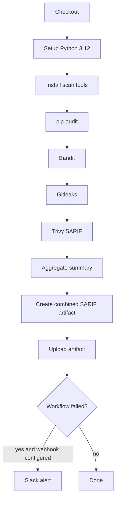

# GitHub Actions Security Scan 설계

Meridian-X의 보안 스캔은 GitHub Actions에서 의존성 취약점, Python 정적 분석, Secret 노출, 파일 시스템 취약점 단서를 자동 점검하는 CI 워크플로입니다. 목적은 배포 차단보다 조기 탐지와 감사 이력 확보에 둡니다.

## 목표

- PR, main push, 정기 실행에서 보안 점검을 자동 수행한다.
- Python 의존성, 코드 패턴, Git secret, 파일 시스템 스캔을 한 워크플로에서 실행한다.
- Trivy SARIF 결과를 artifact로 보관하여 이후 감사와 추적에 사용한다.
- Slack webhook이 설정된 환경에서는 실패 시 알림을 보낼 수 있게 한다.

## 스캔 범위

| 영역 | 도구 | 목적 | 현재 정책 |
| --- | --- | --- | --- |
| 의존성 취약점 | `pip-audit` | `requirements.txt` 기반 알려진 CVE 확인 | 결과 확인용, 워크플로 계속 진행 |
| 정적 분석 | `Bandit` | Python 코드의 보안 취약 패턴 탐지 | 결과 확인용, 워크플로 계속 진행 |
| Secret 탐지 | `Gitleaks` | Git history/worktree의 token, key, credential 탐지 | action 기본 정책 사용 |
| 파일 시스템 스캔 | `Trivy` | repository 파일 시스템 취약점/secret 단서 탐지 | SARIF artifact 생성 |

## 설계 원칙

- **KISS**: 각 도구는 GitHub Actions에서 직접 실행하고 별도 orchestration layer를 두지 않는다.
- **YAGNI**: 복잡한 SARIF 병합/PR comment 자동화는 실제 필요가 생길 때 추가한다.
- **DRY**: Python 버전, 스캔 대상, artifact 이름은 workflow 하나에서 관리한다.
- **Fail-soft**: `pip-audit`, `bandit`, `trivy`는 먼저 관측 가능성을 확보한다. 정책이 안정되면 실패 조건을 강화한다.

## 실행 흐름

## Trigger

- `push` to `main`
- `pull_request`
- 매주 월요일 09:00 UTC cron
- 수동 실행 `workflow_dispatch`

> 현재 workflow 주석에는 KST로 표기되어 있으나 GitHub Actions cron은 UTC 기준입니다.

## Artifact 정책

- Artifact 이름: `SAR_BALL_RESULTS`
- Artifact 파일: `combined.sarif`
- 보관 기간: 30일

## 운영상 제약

- `pip-audit`는 현재 `requirements.txt`를 기준으로 실행한다. 프로젝트의 primary dependency source는 `pyproject.toml`/`uv.lock`이므로, 장기적으로는 `uv export` 기반 생성물과 동기화하는 방식이 더 일관적이다.
- Slack 알림은 `vars.SLACK_WEBHOOK_URL`이 설정된 경우에만 동작한다.
- Trivy 결과는 SARIF로 생성하지만, 현재 workflow는 GitHub Code Scanning 업로드가 아니라 artifact 업로드를 사용한다.
- `combined.sarif` 생성 단계는 여러 SARIF 파일을 단순 append한다. 엄격한 SARIF 병합이 필요하면 JSON merge 방식으로 교체해야 한다.

## 참고 자료

- [GitHub Actions Security Scans](https://docs.github.com/en/code-security/supply-chain-security)
- [pip-audit Documentation](https://pypi.org/project/pip-audit/)
- [Bandit Documentation](https://bandit.readthedocs.io/)
- [Gitleaks Documentation](https://github.com/gitleaks/gitleaks)
- [Trivy Documentation](https://aquasecurity.github.io/trivy/)
- [GitHub Actions SARIF Support](https://docs.github.com/en/code-security/sarif-support-for-code-scanning)
