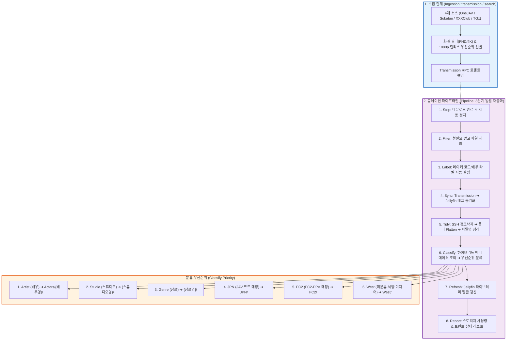

# Architecture & Workflow (아키텍처 및 워크플로우 설계)

Meridian-X의 설계 철학과 2단계 운영 아키텍처(수집 단계 및 8단계 큐레이션 파이프라인)를 설명합니다.

---

## 1. 2단계 운영 아키텍처 (2-Phase Architecture)

---

## 2. 8단계 큐레이션 파이프라인 상세

1. **Stop After Download**: 다운로드가 끝난 토렌트를 자동 정지하여 리소스 낭비를 방지합니다.
2. **Filter**: 불필요한 텍스트 파일, URL 바로가기, 샘플 영상 등 광고 파일을 `unwanted` 처리합니다.
3. **Label**: 토렌트 이름에서 메이커 코드나 배우명을 추출하여 Transmission 라벨을 부여합니다.
4. **Sync**: 부여된 라벨을 Jellyfin 태그로 동기화하여 미디어 서버 검색성을 높입니다.
5. **Tidy**: SSH 원격 연결을 통해 부산물 정크를 삭제하고, 단일 영상 폴더를 Flatten하며, 파일명의 상업용 광고 접두사를 정중히 정화합니다.
6. **Classify**: FANZA, JavBus, OneJAV, StashDB GraphQL API를 하이브리드로 조회하여 배우 폴더(`Actors/{배우}/`)를 최우선으로 스튜디오, 장르, JPN, FC2, West 폴더로 안전하게 분류 이동합니다.
7. **Jellyfin Refresh**: 파일 이동 사항을 Jellyfin 미디어 라이브러리에 일괄 반영합니다.
8. **System Report**: 최종 스토리지 용량 및 토렌트 데몬 상태를 브리핑합니다.

---

## 3. 스마트 릴리스 선별 (`deduplicate_releases`)

동일한 에피소드가 여러 화질 및 릴 그룹으로 배포될 때, 다음과 같은 우선순위 가중치를 기반으로 최고 품질의 단일 릴리스만 선별합니다:

- **해상도 우선순위**: 1080p(FHD, +1000점) > 2160p(4K, +500점) > 720p/SD (제외 대상)
- **릴 그룹 안정성**: WRB / XC (+300점) > TRB (+200점) > P2P (+100점)
