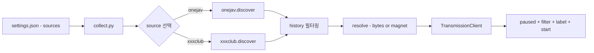

# Multi-Source Architecture Design

**날짜:** 2026-06-08
**결정:** Codex Option 1 — Source Functions
**검증:** Codex gpt-5.5 + Gemini gemini-3.1-pro-preview 교차 검증

---

## 1. Architecture

```text
collect.py (orchestrator)
  → sources/__init__.py (registry)
  → source.discover()  → list[dict]  (RSS 파싱)
  → history 필터링
  → source.resolve()   → bytes|str   (.torrent bytes or magnet URL)
  → TransmissionClient.add_torrent() or add_magnet()
  → history 저장
```



## 2. File Structure

```text
src/meridian_x/
├── cli.py              # CLI (transmission --source)
├── collect.py          # 오케스트레이터 (source 루프)
├── core.py             # config, history 공통 함수
├── transmission.py     # RPC 클라이언트 (add_torrent + add_magnet)
├── classify.py         # 파일 분류
├── fanza.py            # FANZA API
└── sources/
    ├── __init__.py     # SOURCES registry
    ├── onejav.py       # discover(), resolve() → bytes
    └── xxxclub.py      # discover(), resolve() → magnet URL
```

## 3. Source Interface

각 source 모듈은 2개 함수만 제공:

```python
def discover(config: dict) -> list[dict]:
    """RSS/페이지에서 수집 항목 반환.
    Returns: [{"id": "onejav:SNOS155", "title": "...", "page_url": "..."}]
    """
    ...

def resolve(item: dict, config: dict) -> dict:
    """수집 항목을 Transmission 전송 가능 payload로 변환.
    Returns: {"type": "metainfo", "data": bytes} or {"type": "magnet", "data": "magnet:?..."}
    """
    ...
```

## 4. Registry

```python
# sources/__init__.py
from . import onejav, xxxclub

SOURCES = {
    "onejav": onejav,
    "xxxclub": xxxclub,
}
```

## 5. Configuration

```json
{
  "sources": {
    "onejav": {
      "enabled": true,
      "rss_url": "https://onejav.com/feeds/",
      "base_url": "https://onejav.com"
    },
    "xxxclub": {
      "enabled": true,
      "rss_url": "https://xxxclub.to/feed/1080p.FullHD.xml"
    }
  },
  "collection": {
    "history_file": "logs/downloads.txt",
    "request_timeout": 30,
    "user_agent": "Mozilla/5.0 ..."
  },
  "transmission": {
    "rpc_url": "https://heritage.bun-bull.ts.net/transmission/rpc",
    "timeout": 10,
    "filters": {
      "exclude_extensions": [".html", ".url", ".txt", ".nfo"],
      "exclude_keywords": ["sample", "trailer", "preview", "996gg"],
      "min_file_size_mb": 100
    }
  }
}
```

## 6. CLI

```bash
meridian transmission                    # 모든 enabled source
meridian transmission --source onejav    # OneJAV만
meridian transmission --source xxxclub   # XXXClub만
meridian transmission --max-downloads 5  # source당 최대 5개
```

## 7. History

Source prefix로 충돌 방지:

```text
onejav:SNOS155
onejav:200GANA3395
xxxclub:AssParade 26 06 08 Vanna Rose XXX 1080p
```

## 8. Source별 차이

| 구분 | OneJAV | XXXClub |
|:-----|:-------|:--------|
| discover | RSS → page URL 목록 | RSS → magnet link 목록 |
| resolve | page 방문 → .torrent bytes | magnet URL 그대로 반환 |
| payload type | `metainfo` (base64) | `magnet` (filename) |
| label | 메이커 코드 (snos, fc2) | 스튜디오+배우 (vixen, lily love) |
| CF 우회 | 불필요 | 필요시 cloudscraper |

## 9. Migration Path

1. `sources/` 패키지 + `onejav.py` 생성 (기존 `collect.py` 로직 이관)
2. `xxxclub.py` 추가 (magnet 기반)
3. `transmission.py`에 `add_magnet()` 추가
4. `collect.py`를 오케스트레이터로 재작성
5. `settings.json` 구조 변경 (`sources` 딕셔너리)
6. `cli.py`에 `--source` 플래그 추가
