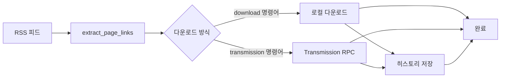

# Transmission RPC Integration Design

**날짜:** 2026-06-08
**목표:** Meridian-X collect 모듈에 Proxmox Transmission RPC 지원 추가

---

## 1. Overview

Meridian-X의 토렌트 다운로드 방식에 **Proxmox Transmission RPC**를 추가합니다. 기존 로 다운로드 방식은 유지하며, 사용자는 설정으로 다운로드 방식을 선택할 수 있습니다.

**주요 특징:**
- 하이브리드 설계: 로컬 다운로드 + Transmission RPC 양방향 지원
- 이중 검증: 로컬 히스토리 + Transmission 중복 체크
- 공통 모듈 분리: 재사용성과 가독성 향상
- CLI 명령어 분리: `download`(로컬) / `transmission`(RPC) — 하위 호환성 무시

---

## 2. Architecture

### 2.1 파일 구조

```
src/meridian_x/
├── cli.py            # 수정 - 명령어 분리 (download/transmission)
├── classify.py        # 변경 없음
├── collect.py        # 수정 - 로컬 다운로드 유지 + Transmission RPC 추가
├── transmission.py    # 신규 - RPC 클라이언트
└── core.py           # 신규 - 공통 함수 분리
```

### 2.2 모듈 설명

#### core.py

공통 함수 분리로 중복 제거 및 재사용성 향상.

**함수:**
- `load_config() -> dict`: 설정 로드 (collect.py, classify.py 중복 제거)
- `load_downloaded_history(history_file: str) -> Set[str]`: 히스토리 로드
- `save_downloaded_history(history_file: str, downloaded: Set[str]) -> None`: 히스토리 저장
- `extract_page_links(rss_content: str) -> List[dict]`: RSS 파싱

#### transmission.py

Proxmox Transmission RPC 클라이언트.

**클래스:**
```python
class TransmissionClient:
    def __init__(self, rpc_url, user=None, password=None, timeout=10)
        """RPC 클라이언트 초기화"""

    def add_torrent(self, metainfo: bytes, download_dir: str = None) -> bool
        """토렌트 메타데이터(base64 인코딩)를 Transmission에 추가"""

    def _rpc_call(self, method: str, arguments: dict = None, max_retries: int = 3) -> dict
        """RPC 요청 공통 메서드 (세션 ID 처리 + 버전 감지)"""
```

#### collect.py

기존 로컬 다운로드 유지 + Transmission RPC 추가.

**함수:**
- `run_local_download(max_count, favorite_url, dry_run)`: 기존 로컬 다운로드
- `run_transmission_rpc(max_count, favorite_url, dry_run)`: Transmission RPC 전송
- 기존 `_get_download_url()`, `_download_torrent()` 유지지

#### cli.py

명령어 분리: `download` / `transmission` / `classify`

---

## 3. Configuration

### 3.1 settings.json

```json
{
  "onejav": {
    "base_url": "https://onejav.com",
    "rss_url": "https://onejav.com/feeds/"
  },
  "transmission": {
    "rpc_url": "https://heritage.bun-bull.ts.net/transmission/rpc",
    "rpc_user": null,
    "rpc_password": null,
    "download_dir": null,
    "timeout": 10,
    "use_env_auth": true  // .env에서 RPC 자격증명 사용 (선택적)
  },
  "download": {
    "watch_path": "/path/to/torrent/watch",
    "history_file": "logs/downloads.txt",
    "request_timeout": 30,
    "user_agent": "Mozilla/5.0 (Windows NT 10.0; Win64; x64) AppleWebKit/537.36"
  }
}
```

**설정 설명:**
- `transmission.rpc_url`: Transmission RPC 엔드포인트 (필수, RPC 사용 시)
- `transmission.rpc_user`: RPC 인증 사용자 (선택적, null이면 인증 없음)
- `transmission.rpc_password`: RPC 비밀번호 (선택적)
- `transmission.download_dir`: 다운로드 경로 (선택적, null이면 Transmission 기본 경로)
- `transmission.timeout`: RPC 타임아웃 (선택적, 기본 10초)

---

## 4. CLI Usage

### 4.1 명령어

```bash
# ========== 로컬 다운로드 ==========
uv run meridian download                         # 로컬 watch_path에 다운로드
uv run meridian download --dry-run               # 미리보기
uv run meridian download --max-downloads 50       # 최대 50개
uv run meridian download --favorite URL            # Favorite 필터링

# ========== Transmission RPC ==========
uv run meridian transmission                     # Proxmox Transmission으로 전송
uv run meridian transmission --dry-run            # 미리보기 (RPC 요청 안 함)
uv run meridian transmission --max-downloads 50    # 최대 50개
uv run meridian transmission --favorite URL         # Favorite 필터링

# ========== 분류 ==========
uv run meridian classify                          # 분류 실행
uv run meridian classify --dry-run                # 미리보기
uv run meridian classify --jav-metadata            # FANZA 메타데이터 기반 분류
```

### 4.2 dry-run 동작

| 모드 | Transmission RPC | 로컬 다운로드 |
|:-----|:---------------|:---------------|
| **Normal** | 실제 RPC 요청 전송 | 실제 파일 다운로드 |
| **Dry-run** | 로그만 출력 (요청 안 함) | 로그만 출력 (파일 조작 안 함) |

---

## 5. Data Flow

### 5.1 메인 흐름



### 5.2 Transmission RPC 상세 흐름

```python
# 1. RSS 피드 가져오기
rss_content = requests.get(ONEJAV_RSS_URL)

# 2. 페이지 링크 추출
page_links = core.extract_page_links(rss_content)

# 3. 이미 다운로드한 것 제외 (로컬 히스토리)
downloaded_history = core.load_downloaded_history(DOWNLOADED_HISTORY_FILE)
new_links = [t for t in page_links if t["id"] not in downloaded_history]

# 4. Transmission RPC 전송
client = TransmissionClient(TRANSMISSION_RPC_URL, ...)
for torrent in new_links:
    torrent_bytes = requests.get(torrent["page_url"]).content

    # 이중 검증: Transmission 중복 확인
    if not client.has_torrent(torrent["id"]):
        if client.add_torrent(torrent_bytes, TRANSMISSION_DOWNLOAD_DIR_DIR):
            downloaded_history.add(torrent["id"])
            downloaded_count += 1

# 5. 히스토리 저장
core.save_downloaded_history(DOWNLOADED_HISTORY_FILE, downloaded_history)
```

### 5.3 이중 검증 (Transmission)

1. 로컬 히스토리에서 ID 제외 (`downloaded_history`)
2. 통과한 ID로 Transmission RPC 전송 시도
3. **중복 감지**: Transmission 자체 `info-hash` 기반 감지 (외부 `has_torrent()` 불필요)
4. 전송 성공/중복 시 로컬 히스토리에 기록

---

## 6. Implementation Plan

### 6.1 단계

1. **core.py 생성**: 공통 함수 분리
2. **transmission.py 생성**: RPC 클라이언트 구현
3. **collect.py 수정**: `run_local_download()` / `run_transmission_rpc()` 분리
4. **cli.py 수정**: 명령어 분리
5. **설정 예시 업데이트**: `settings.json.example`에 `transmission` 블록 추가
6. **테스트**: dry-run으로 검증
7. **문서 업데이트**: CLAUDE.md 업데이트

### 6.2 주요 구현 포인트

#### Transmission RPC torrent-add

`metainfo` 방식 사용 (base64 인코딩):

```python
def add_torrent(self, metainfo: bytes, download_dir: str = None) -> bool:
    base64_metainfo = base64.b64encode(metainfo).decode('utf-8')
    arguments = {"metainfo": base64_metainfo}
    if download_dir:
        arguments["download-dir"] = download_dir

    response = self._rpc_call("torrent-add", arguments)
    return "torrent-added" in response.get("result", {})
```

#### RPC 세션 ID 처리

Transmission RPC는 첫 요청에 세션 ID 반환 → 이후 요청에 포함 필요:

```python
def _rpc_call(self, method: str, arguments: dict = {}) -> dict:
    headers = {"X-Transmission-Session-Id": self._session_id} if self._session_id else {}
    response = requests.post(self._rpc_url, json={"method": method, "arguments": arguments}, headers=headers, ...)

    if response.status_code == 409:
        self._session_id = response.headers.get("X-Transmission-Session-Id")
        return self._rpc_call(method, arguments)

    return response.json()
```

---

## 7. Testing

### 7.1 테스트 방법

```bash
# Transmission RPC 테스트
cp config/settings.json.example config/settings.json
# .env에 transmission 설정 추가
uv run meridian transmission --dry-run

# 로컬 다운로드 테스트
uv run meridian download --dry-run
```

### 7.2 검증 포이트

- Transmission RPC 연결 성공 여부
- base64 인코딩 전송 성공
- 이중 검증 로직 (로컬 히스토리 + Transmission 중복 체크)
- dry-run 동작 (실제 RPC 요청 없음)
- 에러 핸들링 (RPC 실패 시 로그만 출력)

---

## 8. Gotchas

- **세션 ID**: 첫 요청 시 409 오류 반환 → 헤더에서 세션 ID 추출 후 재요청
- **인증 선택적**: `rpc_user`, `rpc_password`가 null이면 인증 없음
- **download_dir 선택적**: null이면 Transmission 기본 다운로드 경로 사용
- **기존 코드 유지**: `_get_download_url()`, `_download_torrent()` 삭제 금지 (로컬 다운로드용)
- **히스토리 파일**: 로컬 `logs/downloads.txt`가 진공(Source of Truth)
- **FC2 코드 스킵**: fanza.py와 달리 Transmission에서는 모두 수집 (필요 시 추가)
