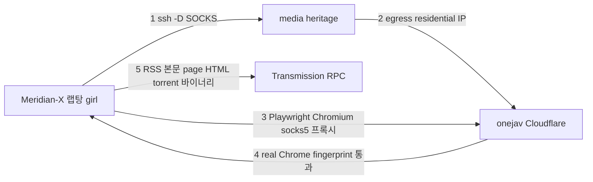
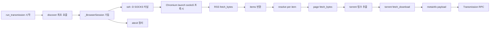

# onejav Cloudflare 우회 (Playwright + SSH SOCKS) — Design

> **Date**: 2026-07-19 (v2, FlareSolverr 안 버전을 전면 폐기하고 재작성)
> **Status**: Proposed
> **Supersedes**: 본 파일의 2026-07-18 FlareSolverr "cookie 제공자" 설계 (실측으로 무효 확인)
> **Related**: homelab `docs/superpowers/specs/2026-07-18-flaresolverr-heritage-design.md` — 본 방향 채택으로 **N/A(폐기 권고)**

## 목차

- [배경](#배경)
- [목표](#목표)
- [결정적 실측 (Ground Truth)](#결정적-실측-ground-truth)
- [핵심 설계](#핵심-설계-playwright--ssh-socks)
- [컴포넌트 변경](#컴포넌트-변경)
- [데이터 플로우](#데이터-플로우)
- [에러 핸들링](#에러-핸들링)
- [검증](#검증)
- [의존 사전조건](#의존-사전조건)
- [리스크](#리스크)
- [스코프 외 (YAGNI)](#스코프-외-yagni)

## 배경

`onejav` source가 `onejav.com` Cloudflare에 차단된다. 기존 `onejav.py`는 heritage SSH経유 plain `curl`로 RSS·page·`.torrent`를 수집했으나, 현재 end-to-end가 전부 RST로 망가져 있다.

2026-07-18 spec은 "FlareSolverr로 `cf_clearance` cookie만 회수, 데이터 수신은 기존 SSH curl로"라는 *arr 표준 패턴을 가정했다. 그러나 2026-07-19 decisive 테스트 결과 이 패턴의 전제가 **둘 다 거짓**임이 확인되어 전면 재설계한다.

## 목표

- onejav source가 RSS 수집 + `.torrent` 다운로드 + Transmission 전송 파이프라인 전체 재동작
- `.torrent` 바이너리 무결성 보존 (bencode 손상 금지)
- 기존 파이프라인(history, dry-run, filters) 변경 없음
- `xxxclub` 등 타 source에 영향 없음
- **homelab 인프라 변경 없음** (본 방향의 핵심 이점)

## 결정적 실측 (Ground Truth)

2026-07-19, heritage residential IP(`221.148.219.1`) egress 기준 실측:

| 클라이언트 | 대상 | 결과 |
| :--- | :--- | :--- |
| plain curl + Chrome UA | `/feeds/` | TLS RST (HTTP 000) |
| curl-impersonate-chrome (standalone) | `/feeds/` | TLS RST |
| curl_cffi (chrome131 / chrome124 / chrome120) | `/feeds/` | **전부 TLS RST** (curl err 35) |
| FlareSolverr (real Chromium Chrome/148) | `/feeds/` | **200, "Challenge not detected!"**, 유효 RSS |
| FlareSolverr (real Chromium) | 토렌트 page | 200, `.torrent` 링크 정상 추출 |
| FlareSolverr (real Chromium) | `.torrent` download URL | 200 이나 `solution.url: chrome://new-tab-page/` → **이진 캡처 불가** (브라우저가 다운로드 처리, 본문 미반환) |
| SSH SOCKS `ssh -D` via media@heritage | (전송) | **동작, egress = heritage IP** 확인 |

**도출 결론:**

1. Cloudflare 게이트는 **TLS/HTTP2 fingerprint 판별**. 모방 라이브러리(curl-impersonate, curl_cffi)는 전부 RST, **real Chromium fingerprint만 유일 통과**. "Challenge not detected!" = 대화형 챌린지가 아니라 fingerprint 게이트 자체.
2. cookie IP binding 전제 **무효**. RST가 TLS 핸드셰이크 단에서 발생 → HTTP 계층 cookie는 평가 자체가 불가. 따라서 "FlareSolverr가 cookie만 주면 plain curl이 수신" 패턴은 구조적으로 불가능.
3. FlareSolverr는 RSS/page는 가능하나 `.torrent` **이진 캡처 불가** (브라우저 다운로드로 빠짐). FlareSolverr-only로는 full chain 불가.
4. 정답 = **real Chromium를 직접 구동해 응답 본문/다운로드를 가로채는 Playwright**뿐.
5. Chromium를 **랩탕(Meridian-X 실행 위치)에서 구동**하고 egress만 SSH SOCKS로 heritage에 터널링하면, real Chromium fingerprint + heritage residential egress를 동시에 만족 → homelab 변경 0.

## 핵심 설계: Playwright + SSH SOCKS



**3가지 설계 원칙:**

1. **real Chromium만 통과** → Playwright sync API로 진짜 Chromium 구동. Playwright `APIRequestContext`(자체 HTTP 클라이언트, fingerprint 없음)는 RST이므로 **사용 금지**. 반드시 `page.goto()` 브라우저 네비게이션 경유.
2. **egress = heritage** → 런타임에 `ssh -D 127.0.0.1:<port> media@heritage` SOCKS5 터널 오픈. Chromium를 `proxy={server: socks5://127.0.0.1:<port>}`로 실행. **DNS leak 방지**: Chromium SOCKS5는 URL load의 target DNS를 proxy-side에서 해석하나 prefetch/resolve 성분은 우회 가능(Chromium `net/docs/proxy.md`). 따라서 launch 옵션에 `--host-resolver-rules="MAP * ~NOTFOUND, EXCLUDE 127.0.0.1"` 명시 부여 + 검증에서 leak 단위 테스트로 확인.
3. **바이너리 무결성** → RSS/page는 `page.goto()` 응답의 `response.body()`(raw bytes)로 수신(렌더링 DOM `page.content()` 사용 금지). `.torrent`는 `page.expect_download()`로 다운로드를 가로채 `save_as()` 후 bytes 회수.

**세션 생명주기 (surgical 핵심):**

`collect.py:74,104` 호출 패턴 — source당 `discover()` 1회 → `resolve(item)` N회가 동일 `run_transmission()` 프로세스 내에서 순차 실행. 따라서 **모듈 단 lazy singleton**로 Chromium+터널을 1회만 기동:

- 첫 `discover()` 시 `_BrowserSession` 기동 (SOCKS 터널 subprocess + Chromium launch)
- 이후 `resolve()` 들이 동일 세션 재사용 (Chromium 재기동 비용 N회 절감)
- `atexit` 로 프로세스 종료 시 터널·브라우저 정리 (단 SIGKILL/크래시에는 미실행 → `start()`의 사전 포트 정리가 보완)
- `discover()` / `resolve()` 서명 불변 → **`collect.py` 무수정**
- **전제**: 단일 프로세스 순차 실행(현재 `collect.py` 구조). 비동기/멀티스레드 도입 시 단일 `Page` 인스턴스 공유가 navigation race 유발 → 그 시점에만 per-call context로 전환 (YAGNI: 지금은 순차)

## 컴포넌트 변경

### `src/meridian_x/sources/onejav.py` (전면 재작성)

기존 SSH+curl 패턴을 Playwright 세션으로 교체. 보존: `_parse_rss()`, payload 구조(`{type: metainfo, data}`).

- **`_BrowserSession` 클래스** (신규): SOCKS 터널 + Chromium 생명주기 관리
  - `start()`: (a) 시작 시 `<port>` 점유 사전 검사 + stale `ssh -D <port>` 정리(atexit 누수/강제 kill 잔존 대비), (b) `subprocess.Popen(["ssh","-N","-D",f"127.0.0.1:{port}","-o","ExitOnForwardFailure=yes","-o","ConnectTimeout=5","-i",ssh_key,"-o","IdentitiesOnly=yes",f"{user}@{host}"])` (포크 `-f` 없이 Popen이 핸들 보관 → 정리 확실, `ExitOnForwardFailure`로 포트 바인딩 실패 시 즉시 종료), (c) 포트 listen 폴링 후 Chromium launch(`proxy={"server": f"socks5://127.0.0.1:{port}"}`, `args=["--host-resolver-rules=MAP * ~NOTFOUND, EXCLUDE 127.0.0.1"]`, headless)
  - `fetch_bytes(url) -> bytes`: `resp = page.goto(url, timeout=...); return resp.body()` (RSS/page raw body. DOM `page.content()` 사용 금지)
  - `fetch_download(url) -> bytes`: `with page.expect_download(timeout=...) as di: resp = page.goto(url)` → 정상 시 `download.save_as(tmp)` → bytes. **timeout/미발생 fallback**: `di` timeout 포착 시 `resp.body()`(inline 응답)로 회수 — fallback 제어흐름을 본 메서드 안에 둠(`close()`에 섞지 않음). `.torrent` 바이너리
  - `close()`: `page`/`browser`/`playwright` 정리 + `ssh_proc.terminate()` → `wait(timeout=5)` → 실패 시 `SIGKILL`. idempotent(재호출 안전)
  - **crash 복구**: Chromium 프로세스 소실 감지 시 lazy singleton 폐기 후 `_get_session` 재호출이 새 인스턴스 생성하도록 설계
- **`_get_session(config) -> _BrowserSession`** (신규): 모듈 글로벌 lazy singleton. `atexit.register(close)`
- **`discover(config)`**: `_get_session` → `fetch_bytes(rss_url)` → `_parse_rss()`
- **`resolve(item, config)`**: `_get_session` → `fetch_bytes(page_url)` → 기존 regex로 `.torrent` 링크 추출 → `fetch_download(dl_url)` → `{"type":"metainfo","data":bytes}`
- 삭제: `_ssh()` 헬퍼, FlareSolverr 관련 모든 코드

> 바이너리는 base64 경유하지 않는다. Playwright가 bytes를 직접 반환하므로 기존 SSH+base64 우회 불필요.

### `config/settings.json` (+ `settings.json.example`)

```json
"onejav": {
  "enabled": true,
  "rss_url": "https://onejav.com/feeds/",
  "base_url": "https://onejav.com",
  "socks_port": 10800,
  "request_timeout": 30
}
```

- `remote`(SSH 자격: `host`/`user`/`ssh_key`)는 최상위 유지 — SOCKS 터널이 media@heritage SSH 재사용
- **`flaresolverr` 섹션 삭제**
- `socks_port` (기본 10800): `127.0.0.1:<port>` bind. 충돌 시 명시적 에러

### `pyproject.toml`

```toml
dependencies = [
    "requests",
    "python-dotenv",
    "transmission-rpc>=7.0.11,<8",
    "playwright>=1.40",
]
```

- 랩탕(girl) 1회: `uv add playwright && uv run playwright install chromium`
- (Linux 필요 시) `uv run playwright install-deps chromium`

### `tests/test_onejav_playwright.py` (신규, 기존 패턴 준수)

- `_BrowserSession`을 fake로 patch → `discover`/`resolve`가 `fetch_bytes`/`fetch_download`를 올바르게 호출하는지 검증 (RSS 파싱, `.torrent` 링크 추출, bytes payload 조립)
- SOCKS 포트 listen 폴링 로직 단위 검증 (mock socket)
- RPC/브라우저/네트워크 없이 단위 테스트 (`test_transmission.py` 동일 스타일)

## 데이터 플로우



## 에러 핸들링

- **SOCKS 터널 기동 실패**(ssh 반환코드/포트 미listen) → 명확한 에러("heritage SOCKS 터널 실패, remote 설정/네트워크 확인"). source 실패, `collect.py` per-source boundary가 전체 보호
- **Chromium launch 실패**(`playwright install chromium` 누락 등) → 안내 메시지와 함께 실패
- **네비게이션 RST/timeout** → real Chromium이므로 통상 발생 않음. 단 발생 시 재시도 1회 후 skip (per-item, 전체 중단 없음)
- **`.torrent` 다운로드 미발생**(inline 응답 등) → `expect_download` timeout 시 `response.body()` fallback. 둘 다 실패면 skip
- **media@heritage SSH 불가/`AllowTcpForwarding=no`** → 터널 기동 단에서 즉시 실패. (2026-07-19 현재 `AllowTcpForwarding` 허용 실증됨)
- **런탕 sleep/wake** → 터널이 끊길 수 있으나 run마다 fresh 기동이므로 자연 회복

## 검증

1. **단위**: `uv run pytest tests/ -v` → Playwright 세션 호출 + SOCKS 폴링 + payload 조립 테스트 통과
2. **gate 통과 실증 (TDD 1순위, 가장 중요한 미실증 가정)**: 구현 첫 단계로 아래 매트릭스를 heritage egress(SOCKS経由)에서 `/feeds/` 대상 측정 — status + body hash + 실패 시 TLS/RST 로그 기록:
   - Playwright **bundled Chromium**(revision 기록), headless vs headed
   - `channel="chrome"`(실제 Chrome channel — FlareSolverr 합격 근거인 real Chrome/148과 동일 계열)
   - 기본 `navigator.webdriver=true`가 bot challenge에 걸리는지 확인
   - **fallback 우선순위**(작은 변경 먼저): (1) `--disable-blink-features=AutomationControlled` → (2) `channel="chrome"` → (3) Patchright(stealth fork). 검증 통과 조합을 본 설계의 Chromium launch 옵션으로 확정
3. **`.torrent` 무결성 fixture**: 1개 `.torrent`를 Playwright로 수신 → `bencodepy`/수동 bdecode로 파싱 성공 + `announce`/`info` 키 존재 확인 (FlareSolverr가 손상시켰던 부분의 회귀 방지)
4. **통합(수동)**:
   - `uv run meridian transmission --source onejav --dry-run` → items 발견
   - `uv run meridian transmission --source onejav --max-downloads 1` → `.torrent` 1개 Transmission 전송 성공 + 실제 다운로드 개시
5. **회귀**: `uv run meridian transmission --source xxxclub --dry-run` 정상 → onejav 변경이 타 source 무영향

## 의존 사전조건

- 랩탕(girl): `uv add playwright` + `uv run playwright install chromium` (1회)
- media@heritage SSH 접근 + `AllowTcpForwarding yes` (2026-07-19 실증)
- heritage Tailscale/IP 도달성 (기존 SSH 경로와 동일)
- **homelab 인프라 변경 없음** — FlareSolverr 컨테이너 불필요

## 리스크

- **Playwright Chromium gate 통과 (미실증)**: 본 설계의 유일한 핵심 가정. FlareSolverr(real Chrome) 합격이 강한 사전근거이나, 번들 Chromium 버전/헤더 차이로 RST 가능성 존재. 검증 2번으로 즉시 확인 → 실패 시 stealth 옵션 or Patchright로 확장 지점 명시
- **Chromium 자원**: headless Chromium ~150~300MB RAM + 디스크. 랩탕 자원 여유 확인 (Meridian-X 실행 주체이므로 전제)
- **SOCKS 처리량/안정성**: `.torrent` 수십 개 일괄 시 터널 부하. 현재 max_count 기반 batch이므로 통상 무리. 과부하 시 run 분할
- **playwright 시스템 의존**: 일부 Linux에서 `install-deps` 필요. 랩탕 환경 의존
- **보안 노출(LOW)**: `127.0.0.1` bind로 LAN 노출은 차단되나, 랩탕 local user/process가 SOCKS 터널経유 heritage egress로 임의 TCP 전송 가능. `media@heritage` 비특권 계정의 SSH key는 onejav 용도 전용 키(`IdentitiesOnly=yes`), `known_hosts` 고정 권장

## 스코프 외 (YAGNI)

- **FlareSolverr 전체** (본 spec이 대체)
- **homelab 변경** (compose/Ansible 전부 미건드림) — homelab spec 폐기
- async Playwright — 기존 동기 코드 스타일 유지
- 영속 터널(systemd) — 랩탕 sleep 대비 run마다 fresh 기동이 더 견고
- Patchright/stealth — "Challenge not detected!"이므로 일반 Chromium로 충분 (gate 통과 실패 시에만 확장)
- 타 source(xxxclub 등) Playwright 연동 — onejav만
- APIRequestContext 사용 — fingerprint 없어 RST, 명시적 금지
