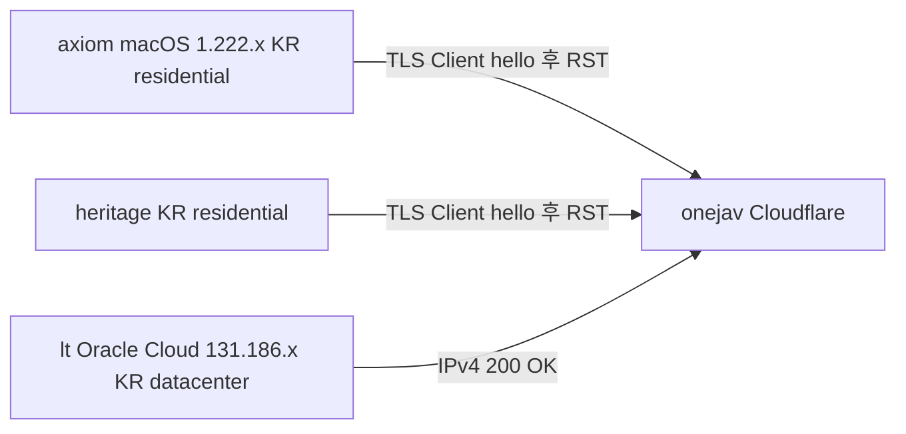

# OneJAV 접근 설계 — lt(Oracle Cloud) IPv4 경유

> **Date**: 2026-07-20
> **Type**: Explanation (설계 결정 조명)
> **Status**: design 확정, 구현 대기
> **선행**: 본 문서는 crong/NixOS 세션의 Playwright pivot 가설을 이 Mac(axiom)에서 실증 검증한 결과, **가설을 전면 폐기**하고 plain curl 경로로 design을 전환한 결정을 기록한다.

## TL;DR

onejav.com 접근 차단 원인은 fingerprint도, SNI/DPI도 아닌 **한국 residential ISP ASN 기반 차단**이다. `lt`(Oracle Cloud Korea, 데이터센터 ASN)에서 **IPv4 강제 시 전체 수집 파이프라인(RSS → 페이지 → .torrent)이 plain curl로 동작**한다. 따라서 Playwright pivot은 폐기하고, 기존 `heritage` SSH+curl 패턴을 `lt`(IPv4)로 교체한다.

## 목차

- [배경: 선행 가설](#배경-선행-가설)
- [조사 과정](#조사-과정)
- [차단 원인 특정](#차단-원인-특정)
- [design 결정](#design-결정)
- [구현 가이드](#구현-가이드)
- [검증 결과](#검증-결과)
- [잔여 이슈](#잔여-이슈)
- [진단 산출물](#진단-산출물)

## 배경: 선행 가설

이전 세션(`2026-07-19` 핸드오프)은 onejav gate를 **Playwright 브라우저 fingerprint로 통과**한다는 가설로 4-task plan을 수립했다. crong/NixOS 세션에서 chromium lib 21개 누락으로 launch 불가 → 이 Mac(axiom, macOS arm64)으로 이관하여 실증을 시도했다. 본 문서는 그 실증 결과 **가설 자체를 기각**하고 대안 design을 확정한다.

## 조사 과정

3단계 가설 검증을 통해 차단 계층을 좁혔다.

| 단계 | 가설 | 검증 | 결과 | 판정 |
| :--- | :--- | :--- | :--- | :--- |
| 1 | Playwright fingerprint gate | 4 variant probe (bundled/disabled-blink/chrome-channel/headed) via heritage SOCKS | 전 variant `ERR_CONNECTION_CLOSED` | launch는 성공, NAV에서 RST |
| 2 | SNI 기반 DPI 차단 | 이 Mac curl + heritage curl `-v` | 둘 다 `Client hello` 송신 후 `reset` | SNI 평문 노출 직후 RST |
| 3 | fingerprint/SNI 무관 — IP/ASN | `lt` exit-node 경유 + lt 직접 curl | **200 + rss**, `.torrent` 200 | 데이터센터 ASN 통과 |

ECH(Encrypted Client Hello) 우회도 시도했으나, playwright bundled Chrome for Testing이 `EncryptedClientHello`/`dns-over-https-*` flag를 무시(netlog에 관련 이벤트 0)하여 기각됐다.

## 차단 원인 특정

- **axiom**(1.222.103.118, 한국 일반 ISP) → RST
- **heritage**(한국 ISP) → RST
- **lt**(131.186.16.115, Oracle Cloud AS31898, 서울 강서구) → **200**

동일 SNI(onejav.com)에 대해 소스 ASN만 다른데 결과가 갈린다 → 차단 계층은 **Cloudflare의 ASN/IP 평가**(residential 한국 대역 거부, 데이터센터 허용). 클라이언트 fingerprint(TLS/JS)와 무관하므로 **Playwright는 근본적으로 불필요**.

> lt 직접 curl은 기본적으로 timeout이 발생하지만, 이는 차단이 아니라 **lt DNS가 onejav를 AAAA(IPv6) 전용으로 resolve**하여 IPv6 경로가 blackhole이기 때문이다. `curl -4`(IPv4 강제)로 200.

## design 결정

1. **Playwright pivot 전면 폐기** — fingerprint gate 가설 기각. 의존성(`playwright`)은 진단 산출물용으로만 보존(프로덕션 불필요).
2. **수집 경로: `heritage` → `lt` 교체** — 기존 `onejav.py`의 SSH command exec 패턴(`ssh <remote> 'curl ...'`)의 대상을 lt로 변경.
3. **IPv4 강제** — lt에서 onejav 접근 시 `curl -4` 필수(AAAA-only DNS + IPv6 blackhole).
4. **전송(Transmission) 경로는 별도 검토** — 본 design은 수집(onejav → .torrent 바이트)까지. Transmission RPC 전송/다운로드 위치는 lt/heritage 디스크 정책에 따라 별도.

## 구현 가이드

`src/meridian_x/sources/onejav.py` 수정 포인트(구현은 별도 세션):

| 항목 | 현행(heritage) | 변경(lt) |
| :--- | :--- | :--- |
| SSH 대상 | `media@100.96.115.19` (`remote.host`) | `lt` (ssh config, `~/.ssh/AI/id_ed25519`) |
| curl 옵션 | `curl -sL` | `curl -4 -sL` |
| RSS | `/feeds/` (변경無) | 동일 |
| .torrent 획득 | (구현 전) | 페이지 `/torrent/<id>` 방문 → `/torrent/<id>/download/<num>/onejav.com_<id>.torrent` 추출 → 다운로드 |

config(`config/settings.json`의 `remote`)은 lt 전용 값으로 갱신 또는 `remote_onejav` 분리. SSH 접근은 `ssh lt`(config 기반)로 단순화 — `remote.ssh_key` 경로(`/opt/data/home/...`) 대신 config의 IdentityFile 사용.

## 검증 결과

lt(IPv4) 경유 plain curl로 3단계 전부 PASS (2026-07-20):

| 단계 | URL | 결과 |
| :--- | :--- | :--- |
| RSS | `https://onejav.com/feeds/` | 200, 10791B, `<rss>` |
| 페이지 | `https://onejav.com/torrent/200gana3413` | 200, 14369B |
| .torrent | `.../download/04739704/onejav.com_200gana3413.torrent` | 200, 21534B, `application/x-bittorrent`, `BitTorrent file` |

## 잔여 이슈

1. **lt 운영 정책** — lt(Oracle Cloud free tier?)를 영구 수집 노드로 쓸 때 대역폭/가용성/비용 확인 필요.
2. **lt DNS IPv6** — 시스템 resolver 수정 또는 앱 단 `-4` 강제로 영구 대응.
3. **SSH 키 경로** — `config/settings.json`의 `remote.ssh_key`(`/opt/data/home/.ssh/id_ed25519`, crong NixOS 경로)를 lt/`ssh lt` config에 맞게 정리.
4. **rate limit / robots** — 데이터센터 IP는 Cloudflare rate limit에 걸리기 쉬움. 수집 주기/UA 정책 필요.
5. **xxxclub 소스** — 본 검증은 onejav만. xxxclub(`https://xxxclub.to/feed/...`)은 lt 경로에서 별도 검증 필요.

## 진단 산출물

본 design 도출에 사용된 probe scripts(진단용, 프로덕션 비타깃):

| 파일 | 용도 | 보존 여부 |
| :--- | :--- | :--- |
| `scripts/probe_onejav_gate.py` | 4 variant gate probe (heritage SOCKS, fingerprint 가설 검증 → RST 입증) | 보존(재검증용) |
| `scripts/probe_onejav_ech.py` | ECH 우회 시도 (Chrome for Testing flag 무시 입증) | 보존(재검증용) |

`playwright` 의존성은 이 scripts 실행용으로 `pyproject.toml`에 유지. 프로덕션 수집 경로는 curl 기반이므로 runtime에는 불필요.
