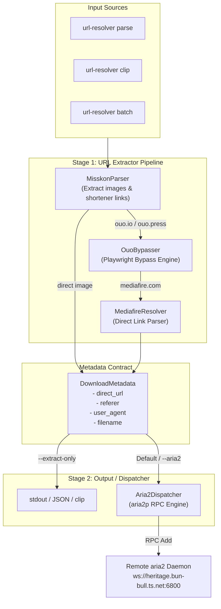

# `url-resolver` (Direct Link Extractor & Aria2 Dispatcher CLI) Design Specification

**Date:** 2026-08-09  
**Status:** Approved / Draft for Implementation  
**CLI Executable Name:** `url-resolver`  

---

## 1. Executive Summary

`url-resolver`는 `misskon.com` 등과 같이 복잡한 웹페이지 및 단축 링크 체인(`ouo.io`, `ouo.press`, `mediafire.com` 등)에서 대용량 파일의 **최종 직링크(Direct Download URL)**와 **Referer/User-Agent 메타데이터**를 자동으로 추출하고, 선택적으로 원격 `aria2` 서버(`ws://heritage.bun-bull.ts.net:6800`)로 전달하는 2단계 파이프라인 CLI 도구이다.

---

## 2. Core Principles & Goals

1. **Separation of Concerns (2-Stage Pipeline)**:
   - **Stage 1 (Extractor Engine)**: 웹페이지 HTML 파싱, `ouo.io` 바이패스, `MediaFire` 직링크 파싱 및 메타데이터 생성.
   - **Stage 2 (Dispatcher Engine)**: `aria2p` 기반 원격 aria2 RPC 전송.
2. **Robust Bypass Success Rate**:
   - `ouo.io` / `ouo.press` 바이패스 성공률 99%+ 달성을 위해 Playwright 기반 세션/리다이렉션 핸들러 내장.
3. **KISS & Flexibility**:
   - 추출 전용 모드(`--extract-only`)와 aria2 자동 전송 모드를 단일 CLI 명령어로 유연하게 통합.

---

## 3. System Architecture



---

## 4. Data Contract Specification

```python
from dataclasses import dataclass
from typing import Optional

@dataclass
class DownloadMetadata:
    direct_url: str          # 최종 직링크 (예: https://download1586.mediafire.com/...)
    referer: str             # 원본 웹페이지 URL (핫링크 방지용)
    user_agent: str          # HTTP User-Agent
    filename: Optional[str]  # 추출되거나 지정된 파일명
    source_page: str         # 요청받은 원본 게시글 주소
```

---

## 5. CLI Interface & Commands Specification

### Base Command: `url-resolver`

* **`url-resolver parse <URL>`**
  - **설명**: 웹페이지 주소를 입력받아 직링크 추출 및 aria2 전송 처리.
  - **옵션**:
    - `--extract-only`: aria2로 전송하지 않고 최종 직링크/메타데이터만 출력.
    - `-o, --output <path>`: 추출 결과를 텍스트/JSON 파일로 저장.
    - `-c, --copy`: 추출된 직링크 목록을 클립보드로 복사.
    - `--json`: 메타데이터 전체를 JSON 형태 포맷으로 출력.

* **`url-resolver clip`**
  - **설명**: 클립보드에 복사되어 있는 URL을 자동으로 읽어서 `parse` 수행.

* **`url-resolver batch <file.txt>`**
  - **설명**: 파일 내 줄바꿈으로 구분된 웹페이지 URL들을 일괄 파싱 및 전송.

* **`url-resolver monitor`**
  - **설명**: 원격 aria2 서버의 실시간 다운로드 상태 모니터링 (Rich TUI 기반).

---

## 6. Detailed Module Specifications

### 6.1 `MisskonParser`
- `httpx` 및 `BeautifulSoup4`를 사용하여 `misskon.com` HTML 파싱.
- 본문 이미지 (`` 태그 중 화보 메인 이미지) 수집.
- `<a>` 태그의 `href` 및 innerText 파싱하여 `ouo.io`, `ouo.press`, `mediafire.com` 추출.

### 6.2 `OuoBypasser`
- `ouo.io` / `ouo.press` 페이지에 대해 Playwright (Chromium Headless) 세션 실행.
- 리다이렉트 흐름 및 폼 제출 후 최종 목적지 URL(`mediafire.com` 등) 수집.

### 6.3 `MediafireResolver`
- MediaFire 공유 페이지 DOM 파싱.
- `#downloadButton` 또는 `aria-label="Download file"` 태그에서 `downloadXXXX.mediafire.com` 형태의 실제 직링크 추출.

### 6.4 `Aria2Dispatcher`
- `~/.config/url-resolver/config.toml`에서 aria2 호스트 (`ws://heritage.bun-bull.ts.net:6800`) 및 secret 토큰 정보 읽기.
- `aria2p`를 이용해 `direct_url` 전송 시 `header` 옵션에 `Referer: <referer>` 및 `User-Agent: <user_agent>` 주입.

---

## 7. Error Handling & Edge Cases

1. **`ouo.io` Bypass Failure**:
   - 캡차 수동 확인 필요 시 Timeout 및 명확한 에러 로그 출력 후 다음 URL로 진행.
2. **MediaFire Direct Link Expiry**:
   - MediaFire 직링크 추출 즉시 aria2 RPC로 넘겨 세션 만료 방지.
3. **Network Timeout / Rate Limit**:
   - `httpx` 및 Playwright 요청 시 백오프(Exponential Backoff) 재시도 로직 포함.

---

## 8. File Structure Layout in Repository

```
src/
└── url_resolver/
    ├── __init__.py
    ├── cli.py               # Typer CLI Entrypoint
    ├── config.py            # TOML Config Management
    ├── models.py            # DownloadMetadata dataclass
    ├── extractors/
    │   ├── __init__.py
    │   ├── base.py          # Base Extractor Interface
    │   ├── misskon.py       # Misskon HTML Parser
    │   ├── ouo.py           # Ouo.io Playwright Bypasser
    │   └── mediafire.py     # MediaFire Resolver
    ├── dispatchers/
    │   ├── __init__.py
    │   └── aria2.py         # aria2p Dispatcher
    └── ui/
        ├── __init__.py
        └── monitor.py       # Rich TUI Monitor
docs/
└── superpowers/
    └── specs/
        └── 2026-08-09-url-resolver-design.md
```
