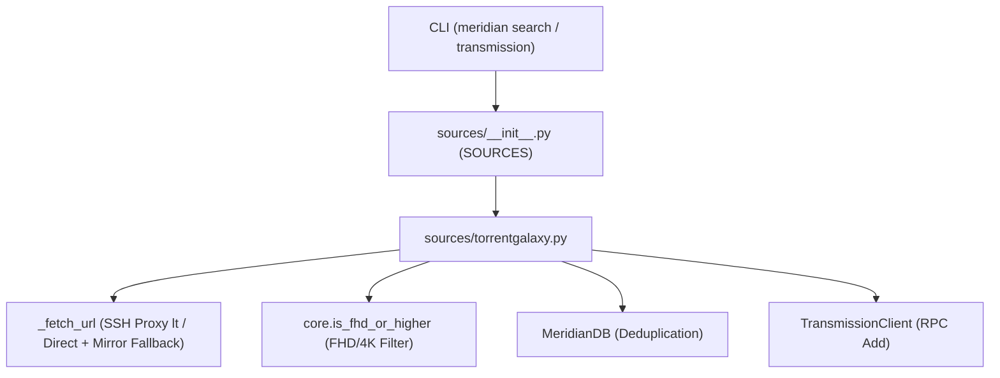

# TorrentGalaxy (TGx) Source Integration Design Specification

- **Date**: 2026-08-20
- **Status**: Approved
- **Target**: `src/meridian_x/sources/torrentgalaxy.py`

---

## 1. Overview

TorrentGalaxy (TGx) is a major Western P2P torrent indexer providing high-speed studio releases (WRB, NBQ, LEWD, P2P) across 1080p and 4K categories. This specification defines the integration of TorrentGalaxy as a standard media source in Meridian-X alongside `onejav`, `xxxclub`, and `sukebei`.

---

## 2. Requirements & Goals

1. **Standard Source Interface**:
   - Implement `discover(config: dict) -> list[dict]` for RSS syndication.
   - Implement `search(query: str, category: str = "42", config: dict = None) -> list[dict]` for keyword searches.
   - Implement `resolve(item: dict, config: dict) -> dict | None` and `resolve_magnet(item_or_details_url: dict | str, config: dict = None) -> str | None`.
   - Implement `is_whitelisted_title(title: str, config: dict) -> bool` using WEST artist and studio mappings.
2. **Strict FHD/4K Resolution Filtering**:
   - Integrate `core.is_fhd_or_higher` to accept only 1080p and 4K releases while excluding SD/720p and 8K/VR.
3. **Multi-Mirror Resilience & Remote Proxy**:
   - Support primary domain `https://torrentgalaxy.to` with automatic fallback to mirrors (`https://tgx.rs`, `https://torrentgalaxy.mx`).
   - Support SSH proxy execution (`remote: {"ssh_alias": "lt"}`) for SNI/Cloudflare bypass.
4. **CLI & Transmission Compatibility**:
   - Register `"torrentgalaxy"` and alias `"tgx"` in `SOURCES`.
   - Support `meridian search "<query>" --source torrentgalaxy` (or `--source tgx`).
   - Include TorrentGalaxy in multi-source collect (`meridian transmission`).

---

## 3. Architecture & Data Flow



### Module Structure: `src/meridian_x/sources/torrentgalaxy.py`

- `DEFAULT_BASE_URL = "https://torrentgalaxy.to"`
- `DEFAULT_MIRRORS = ["https://tgx.rs", "https://torrentgalaxy.mx", "https://torrentgalaxy.one"]`
- `DEFAULT_CATEGORY = "42"` (XXX Video category)
- `_tgx_remote(config: dict) -> dict`: Resolves `sources.torrentgalaxy.remote` or root `remote`.
- `_fetch_url(url: str, config: dict, mirrors: list[str] = None) -> tuple[bool, str]`: Executes curl via `lt` SSH proxy or direct HTTP with automatic mirror fallback.
- `_parse_rss(rss_content: str) -> list[dict]`: Parses RSS `<item>` tags, extracting ID (`tgx:{id}`), title, magnet URL, and pubDate.
- `_parse_search_html(html_content: str, base_url: str) -> list[dict]`: Parses TGx table rows (`div.tgxtablerow` / table elements), extracting title, magnet URL, size, seeders, leechers.

---

## 4. Configuration Schema

In `config/settings.json.example`:
```json
"sources": {
  "torrentgalaxy": {
    "enabled": true,
    "base_url": "https://torrentgalaxy.to",
    "mirrors": [
      "https://tgx.rs",
      "https://torrentgalaxy.mx"
    ],
    "rss_url": "https://torrentgalaxy.to/rss?cat=42",
    "default_category": "42",
    "remote": {
      "ssh_alias": "lt"
    },
    "request_timeout": 30,
    "user_agent": "Mozilla/5.0 (Windows NT 10.0; Win64; x64) AppleWebKit/537.36"
  }
}
```

---

## 5. Testing & Verification

1. **Unit Tests (`tests/test_torrentgalaxy.py`)**:
   - `test_is_whitelisted_title`: Checks WEST artist/studio matching combined with `is_fhd_or_higher`.
   - `test_tgx_rss_parsing`: Verifies XML parsing, item extraction, and duplicate handling.
   - `test_tgx_search_parsing`: Verifies HTML table row parsing, size extraction, seeders/leechers, and direct magnet links.
   - `test_tgx_fetch_mirror_fallback`: Verifies fallback to secondary mirrors on failure.
   - `test_tgx_cli_routing`: Verifies `meridian search --source tgx` routing.
2. **Regression Suite**:
   - `uv run pytest tests/` must pass 100%.
